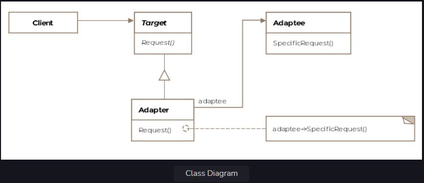

Adapter Pattern
Adapter pattern is similar to how an electrical adapter lets your laptop work both in the US or UK even though voltages
are different.

We'll cover the following

What is it ?
Class Diagram
Example
Object Adapter
Class Adapter
Other Examples
What is it ?
When two heads of states who don't speak a common language meet, usually a language interpreter sits between the two and
translates the conversation, thus enabling communication. The Adapter pattern is similar in that it sits between two
incompatible classes that otherwise can't work with eachother and lets them work together. Another example to consider
is when one buys electronics from USA and tries to use them in India. The two countries have different power voltages
being distributed to consumers and using an electronic appliance from one country in another requires a physical adapter
which steps up or down the voltage appropriately. The concept of the software adapter pattern is similar.

Formally, the adapter pattern is defined as allowing incompatible classes to work together by converting the interface
of one class into another expected by the clients

.
Class Diagram
The class diagram consists of the following entities

Target
Client
Adaptee
Adapter
Class Diagram
Class Diagram

Example
Let's take our aircraft example again. Your software only deals with fancy jets but suddenly you are required to adapt
your software to cater to a local hot air balloon company. Rewriting your software from scratch is not feasible. To
complicate matters the balloon company already provides you with classes that represent hot air balloons which are
incompatible with your IAircraft interface, which you use to represent modern aircraft. We'll use the adapter pattern to
make the hot air balloon classes work with our existing infrastructure for aircraft. Let's see what the balloon class
looks like:

public class HotAirBalloon {

    String gasUsed = "Helium";

    void fly(String gasUsed) {
        // Take-off sequence based on the kind of feul
        // Followed by more code.  
    }

    // Function returns the gas used by the balloon for flight
    String inflateWithGas() {
        return gasUsed;
    }

}
Unfortunately, the fly method for the HotAirBalloon class is parametrized and can't work with the IAircraft interface.
We'll need an adapter here that can make the HotAirBalloon class work with the IAircraft interface. The adapter in
pattern-speak should implement the client interface, which is the IAircraft interface.

public interface IAircraft {
void fly();
}
The adapter implementation would be the following:

public class Adapter implements IAircraft {

    HotAirBalloon hotAirBalloon;

    public Adapter(HotAirBalloon hotAirBalloon) {
        this.hotAirBalloon = hotAirBalloon;
    }

    @Override
    public void fly() {
        String feulUsed = hotAirBalloon.inflateWithGas();
        hotAirBalloon.fly(feulUsed);
    }

}
The important things to note about the adapter are:

The adapter is composed with the Adaptee object, which in our case is the HotAirBalloon object.

The adapter implements the interface the client knows about and consumes. In this case, it is the IAircraft.

Let's see the client code now

    public void main() {

        HotAirBalloon hotAirBalloon = new HotAirBalloon();
        Adapter hotAirBalloonAdapter = new Adapter(hotAirBalloon);
        
        hotAirBalloonAdapter.fly();
    }

Note the client is manipulating objects that implement the IAircraft interface. It doesn't know anything about the
HotAirBalloon class and the adapter is responsible for masking the gory details for the client. The client can now make
a hot air balloon fly even though it deviates from the fly() method enforced by the IAircraft interface.

Object Adapter
The hot air balloon example that we just discussed is really an object adapter example. We composed the adapter with the
adaptee object to make incompatible classes work together. In the case of Java, we can only practice object adaptation
for reasons you'll learn shortly.

Using objects for adaptation gains us the usual benefits of object composition, The design becomes flexible and the
adapter can stand in place of the adaptee or any of its subclassed-objects.

Class Adapter
The complementary concept to object adapter is the class adapter. The class adapter works via multiple inheritance which
isn't supported in Java. However, the idea is that the adapter extends both, the interface in use by the client, as well
as, the adaptee class. Adaptation works via inheritance instead of composition.

One benefit of the adaptation via inheritance is that behavior can be overridden or new functionality can be added in
the adapter.

Other Examples
If you have two applications, one spits out output as XML and the other takes in input as JSON then you'll need an
adapter between the two to make them work seamlessly.

Enumeration is a read-only interface from early days of Java which had only two methods hasMoreElements and nextElement.
Later on, when Sun released Collections, it introduced the Iterator interface which also allows to remove elements. To
support legacy code, we can create an adapter class to translate between the two interfaces and since enumeration is
read-only, it can throw a runtime exception, when an item removal is requested.

In the Java API, one can find java.io.InputStreamReader and java.io.OutputStreamWriter as examples of the adapter
pattern