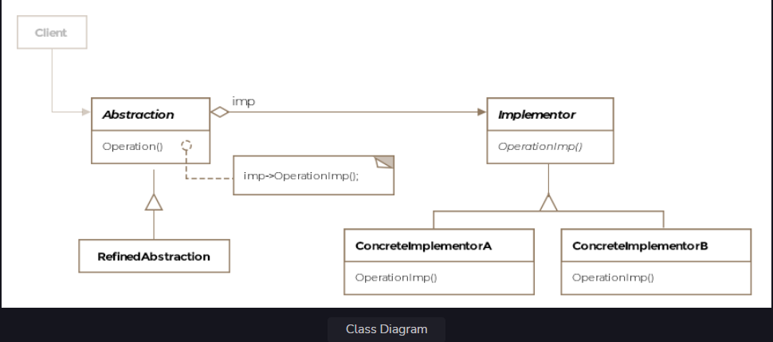
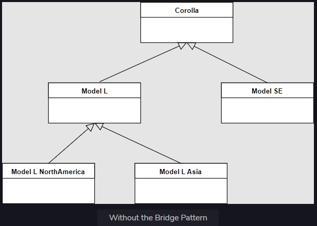
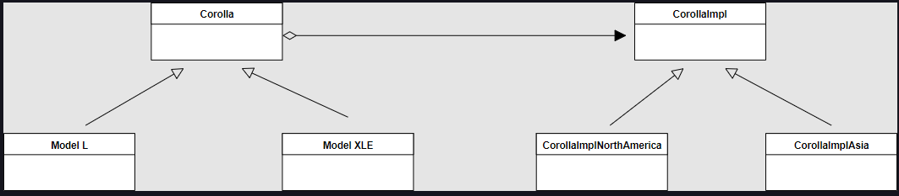

Bridge Pattern
This lesson discusses how parallel class hierarchies or layers can be decoupled from one another using the bridge
pattern.

We'll cover the following

What is it ?
Class Diagram
Example
Other Examples
Caveats
What is it ?
A physical bridge provides connectivity between two points. The bridge pattern describes how to pull apart two software
layers fused together in a single class hierarchy and change them into parallel class hierarchies connected by a bridge.

The bridge pattern can be applied to scenarios where the class and what it does changes often. Think of it as two layers
of abstraction. The class itself becomes one layer and what it does i.e. the implementation becomes another layer. This
setup allows us to extend the two layers independently of each other. In Java, both the layers would be represented by
two separate class hierarchies. The bridge sits between these two class hierarchies, allowing the class abstraction to
configure itself with the implementation abstraction.

Formally, the bridge pattern lets you vary the abstraction independently of the implementation, thus decoupling the two
in the process. However, the abstraction and the implementation in the definition don't mean Java's abstract
class/interface and concrete classes respectively.

Class Diagram
The class diagram consists of the following entities

Abstraction
Refined Abstraction
Implementor
Concrete Implementor
Class Diagram
Class Diagram

Example
Suppose you are writing software for Toyota Motors and need to represent the most sold car in the world - the Toyota
Corolla. We'll use an abstract class Corollato represent the car. The concrete classes would represent each of the
different models of the car. So far so good. However, the same model could be built to different standards for different
locales. For instance, the North American model may have different safety requirements than an Asian model. The same
model could be left or right handed depending on which country it is being shipped to. Corolla has several models and
the models have different names in different countries. In the US, the different models include L, LE, XLE etc. For our
purposes we'll consider only one model L.

Let's see how the class hierarchy would look like.

Without the Bridge Pattern

Without the Bridge Pattern
We can divide the above class structure into two hierarchies. One that just represents the models of the car and another
that represents the location-specific variations for each model of the car. After applying the pattern the class diagram
would look like below:

svg viewer

So you can see there's one hierarchy of class the Corolla which would have subclasses for each of the models, however,
the actual car produced by the factory may be different from another car of the same model that is destined for a
different country. The implementation of the car would make up a separate class hierarchy CorollaImpl which will have
implementation subclasses for each of the Corolla models and have information such as safety equipment installed,
whether the car is left or right handed drive etc.

You would have guessed by now that the class Corolla (the abstraction) would hold a reference to an object of the class
CorollaImpl(the implementation) and invoke method calls on the implementation object. We are using object composition to
add location dependent behavior to each model of the car.

Let's examine the first class hierarchy that represents the car Corolla and acts as the abstraction.

public abstract class AbstractCorolla {

    protected AbstractCorollaImpl corollaImpl;

    public AbstractlCorolla(AbstractCorollaImpl corollaImpl) {
        this.corollaImpl = corollaImpl;
    }

    abstract void listSafetyEquipment();

    abstract boolean isCarRightHanded();

}
The AbstractCorolla holds a reference to the implementation class AbstractCorollaImpl object. The abstract class
AbstractCorollaImpl forms a parallel class hierarchy and is defined below.

public abstract class AbstractCorollaImpl {

    abstract void listSafetyEquipment();

    abstract boolean isCarRightHanded();

}
The class that represents the model L is shown below:

public class Corolla_L extends AbstractCorolla {

    public Corolla_L(AbstractCorollaImpl corollaImpl) {
        super(corollaImpl);
    }

    @Override
    void listSafetyEquipment() {
        corollaImpl.listSafetyEquipment();

    }

    @Override
    boolean isCarRightHanded() {
        return corollaImpl.isCarRightHanded();
    }

}
We'll have corresponding implementation classes for the L model. They are given below:

public class Corolla_L_Impl_AsiaPacific extends AbstractCorollaImpl {

    @Override
    void listSafetyEquipment() {
        System.out.println("Not so safe.");
    }

    @Override
    boolean isCarRightHanded() {
        return false;
    }

}

public class Corolla_L_Impl_NorthAmerica extends AbstractCorollaImpl {

    @Override
    void listSafetyEquipment() {
        System.out.println("High safety standards.");
    }

    @Override
    boolean isCarRightHanded() {
        return true;
    }

}
The client can use the classes like so:

public class Client {

    public void main() {

        AbstractCorolla myCorolla = new Corolla_L(new Corolla_L_Impl_AsiaPacific());
        System.out.println(myCorolla.isCarRightHanded());

        myCorolla.setCorollaImpl(new Corolla_L_Impl_NorthAmerica());
        System.out.println(myCorolla.isCarRightHanded());
    }

}
Note how the client can switch out the implementation class object at runtime and make the model behave for an entirely
different location. Using the bridge pattern we have avoided permanent binding of models and their intended locations of
operation. The client can continue to work with the objects of the abstraction layer without noticing any changes to
implementation layer classes. New safety rules or regulations would only affect the implementation layer classes.

Other Examples
Consider the development of a GUI toolkit. The toolkit will likely use system level api calls specific to the operating
system. If you design a widget menu then you'll need to subclass the menu for both Windows and Linux. If you have
several dozen widgets then each widget class will end up with subclasses for each operating system you intend to target.
The code slowly becomes one giant monolith that is hard to change or debug.

The bridge pattern suggest to create two class hierarchies. One captures the widget operations and another which
encapsulates the system specific api details. Before the change we could have the following classes:

Menu and its derived classes MenuWindows and MenuLinux

After applying the bridge pattern, the resulting classes would be

Menu

AbstractMenuImpl and its derived classes MenuImplWindows and MenuImplLinux

When a Menu object is instantiated we can compose it with either of the implementation classes to target different
operating systems.

Caveats
The bridge pattern may be confused with the adapter pattern but one difference between the two is that the adapter
pattern is usually applied after a system is designed whereas the bridge pattern is intentionally applied as part of the
design process to decouple the two layers.