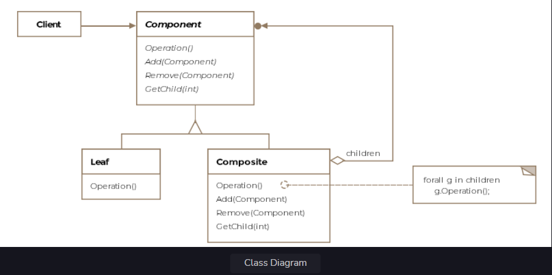
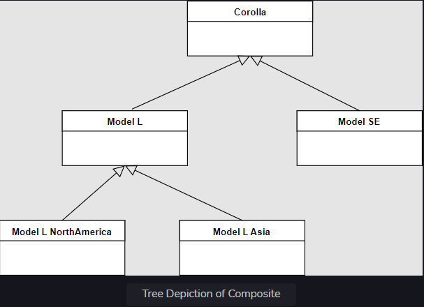

Composite Pattern
This lesson discusses the composite pattern that lets us treat individual elements and group of elements as one.

We'll cover the following

What is it ?
Class Diagram
Example
Other Examples
Caveats
What is it ?
Composite literally means made up of various elements or parts. The pattern allows you to treat the whole and the
individual parts as one. The closest analogy you can imagine is a tree. The tree is a recursive data-structure where
each part itself is a sub-tree except for the leaf nodes. The root is the top-level composite and its children are
either composites themselves or just leaf nodes. The leaf itself can be thought of as a tree with just a single node.

Formally, the composite pattern is defined as composing objects into tree structures to represent part-whole
hierarchies, thus letting clients uniformly treat individual objects and composition of objects.

The pattern allows the clients to ignore the differences between the whole and the part.

Class Diagram
The class diagram consists of the following entities

Component
Leaf
Composite
Client
Class Diagram
Class Diagram

Example
Assume, that we now want to represent all the aircraft in the combined air forces of the NATO alliance. An air force is
primarily made up of several aircraft but it can also have sub-air forces. For instance, the US has the 1st Air Force,
2nd Air Force so on and so forth. Our NATO alliance can consist of air forces from multiple countries including
individual planes.

If we want to treat the composite and each part as the same, we would need both the part (the aircraft) and the whole (
the airforce) to implement the same interface. In our scenario we'll create three classes:

Airforce
F16
C130Hercules
Tree Depiction of Composite

Tree Depiction of Composite
The class Airforce will represent the composite and the other two classes the part. Furthermore, we'll create an
interface IAlliancePart that will allow us to treat the objects from each of the three classes as one type.

Each aircraft requires some number of pilots to operate and maybe peripheral staff for maintainance. The classes would
implement the funtionality to return the number of personnel required for the aircraft to operate. The Airforce class
should return the total number of personnel required to operate all the aircraft composed of the airforce.

public interface IAlliancePart {

    // Any implementing class should return the
    // the number of personnel or staff required
    // to operate the aircraft or the airfoce
    int getPersonnel();

}
The classes implementing the above interface appear below:

public class F16 implements IAircraft, IAlliancePart {

    @Override
    public int getPersonnel() {
        // We need 2 pilots for F-16
        return 2;
    }

}

public class C130Hercules implements IAircraft, IAlliancePart {

    @Override
    public int getPersonnel() {
        // This cargo plane, needs 5 people
        return 5;
    }

}
The above two classes act as parts, now we'll write the composite class Airforce.

public class Airforce implements IAlliancePart {

    ArrayList<IAlliancePart> planes = new ArrayList<>();

    public void add(IAlliancePart alliancePart) {
        planes.add(alliancePart);
    }

    @Override
    public int getPersonnel() {

        // We iterator over the entire air force which can
        // contain leaf nodes (planes) or other composites
        // (air forces). This iteration is an example of an
        // internal iterator.
        Iterator<IAlliancePart> itr = planes.iterator();
        int staff = 0;

        while (itr.hasNext()) {
            staff += itr.next().getPersonnel();
        }

        return staff;
    }

}
Pay attention to the getPersonnel method for the Airforce class. It is an example of an internal iterator. It is called
internal because the Airforce assumes the responsibility of iterating over itself and its subparts. The iteration can
also be extracted out into a separate class and would make an example of an external iterator.

The internal iterator will recursively call the getPersonnel method on the nested air force objects. The leaves would
actually be the planes and will return a number. The personnel count for the root air force object will be the sum of
all the people required to operate all the planes.

The client can invoke the getPersonnel method on the root object and get a total count. Note how transparency is created
by treating the composite and the part as same. The client code or the internal iterator code doesn't need conditional
if-else statements to check for the type of the object and then call the appropriate method on it. The client code
appears below:

public class Client {

    public void main() {

        Airforce NatoAllaiance = new Airforce();
        
        // The nested methods aren't listed for brevity's sake
        NatoAllaiance.add(createCanadaAirForce());
        NatoAllaiance.add(createUSAAirForce());

        F16 frenchF16 = new F16();
        C130Hercules germanCargo = new C130Hercules();

        NatoAllaiance.add(frenchF16);
        NatoAllaiance.add(germanCargo);

        System.out.println(NatoAllaiance.getPersonnel());
    }

}
Note ours is a simple example with a single method and we chose an interface instead of an abstract class to represent
the whole and the part. If we opted for the latter, we could have provided default implementations for some methods.

The composite pattern allows a client to work seamlessly with a composite object. The client doesn't need to distinguish
between the composite and the part. To make this happen, the composite, as well as, the part needs to implement a common
interface or inherit from a common abstract class. This will let the client invoke common methods on both. However, it
is possible that the common super-type has methods which make sense for the part and not for the composite or vice
versa. Say our interface IAlliancePart could have a method fire() which would be applicable to the part, i.e. the plane
but not to the composite, i.e. the air force. In such a scenario, it is ok to put in a default implementation or throw
an UnSupportedOperationException.

Other Examples
In Java, the class javax.faces.component.UIComponent is an example of the composite.

Imagine a UI Menu widget which can have sub-menus and menu items that perform some action when clicked on by the user.
The menus would form the composite while the menu-items would form the part.

Caveats
references to parents: Since the composite is a tree structure, one may or may not need to store references to the
parent.

ordering of children in a composite: In some scenarios, it might be required to store or traverse the children in a
certain order within the composite.

cacheing part of the composite for traversal: For complex composites, it may make sense to cache part of the composite
object to speed up traversal or search.