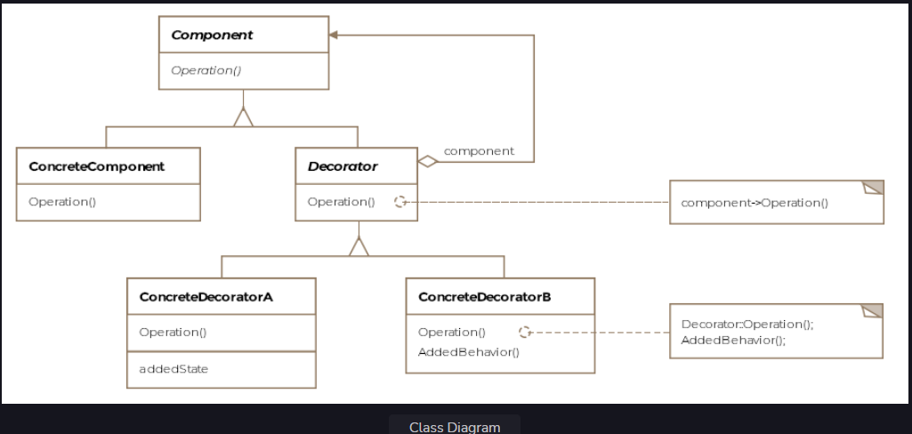

Decorator Pattern
This lesson discusses how objects can be enhanced with new behavior using the decorator pattern.

We'll cover the following

What is it ?
Class Diagram
Examples
Other Examples
Caveats
What is it ?
A decoration is added to something to make it more attractive, in the same spirit, the decorator pattern adds new functionality to objects without modifying their defining classes.

The decorator pattern can be thought of as a wrapper or more formally a way to enhance or extend the behavior of an object dynamically. The pattern provides an alternative to subclassing when new functionality is desired.

The strategy is to wrap the existing object within a decorator object that usually implements the same interface as the wrapped object. This allows the decorator to invoke the methods on the wrapped object and then add any additional behavior. Usually, the decorator adds behavior to the existing functionality of the wrapped object i.e. the decorator takes action either before or after invoking some method on the wrapped object.

Class Diagram
The class diagram consists of the following entities

Component
Concrete Component
Decorator
Concerete Decorator
Class Diagram
Class Diagram

Examples
To better understand the decorator pattern, let's go back to our aircraft example. The aircraft are produced somewhat similar to cars. There's the base model of a car and then there are optional packages that a customer can request to be added to the car. For instance a car can have a technology package added to the base model, then maybe the sports package so on and so forth. Similarly, our base Boeing-747 model can have two additional properties added to it. One is to let the plane be fitted with luxury fittings and the other is making the plane bullet-proof.

Say we are interested in the weight of our plane, which can be important in determining the fuel required for flights. Adding either or both of the options would make the plane heavier. We would want an extensible way of adding properties to the plane object and still be able to know its weight with the additional packages installed on the plane.

Let's first see how the aircraft interfaces and classes look like:

public interface IAircraft {

    float baseWeight = 100;

    void fly();

    void land();

    float getWeight();

}

public class Boeing747 implements IAircraft {

    @Override
    public void fly() {
        System.out.println("Boeing-747 flying ...");
    }

    @Override
    public void land() {
        System.out.println("Boeing-747 landing ...");
    }

    @Override
    public float getWeight() {
        return baseWeight;
    }
}

The decorator pattern requires an abstract decorator class that implements the abstract interface for the object being wrapped. In this case, we call our decorator BoeingDecorator and have it implement the IAircraft interface.

public abstract class BoeingDecorator implements IAircraft {

}

We'll have two concrete decorators, one for the luxury fittings and the other for bullet proofing the plane.

public class LuxuryFittings extends BoeingDecorator {

    IAircraft boeing;

    public LuxuryFittings(IAircraft boeing) {
        this.boeing = boeing;
    }

    @Override
    public void fly() {
        boeing.fly();
    }

    @Override
    public void land() {
        boeing.land();
    }

    @Override
    public float getWeight() {
        return (30.5f + boeing.getWeight());
    }
}

public class BulletProof extends BoeingDecorator {

    IAircraft boeing;

    public BulletProof(IAircraft boeing) {
        this.boeing = boeing;

    }

    @Override
    public void fly() {
        boeing.fly();
    }

    @Override
    public void land() {
        boeing.land();
    }

    @Override
    public float getWeight() {
        return 50f + boeing.getWeight();
    }
}
See how the concrete decorators save a reference to the object that they wrap. The getWeight method in each decorator calls the base model's getWeight to get the base model's weight and then adds the weight added to the plane because of itself. The client can use the decorators like so:

public class Client {

    public void main() {
        IAircraft simpleBoeing = new Boeing747();
        IAircraft luxuriousBoeing = new LuxuryFittings(simpleBoeing);
        IAircraft bulletProofBoeing = new BulletProof(luxuriousBoeing);
        float netWeight = bulletProofBoeing.getWeight();
        System.out.println("Final weight of the plane: " + netWeight);
    }
}
From the client code, one can observe how the plane's behavior is extended at runtime. Note that the decorator's abstract class implements the same interface as the Boeing747. This is so that the concrete decorator object can stand in place of the Boeing object. From the client code, one can see how we wrap the boeing object in successive decorators and are able to retrieve the net weight.

Other Examples
A prominent example of this pattern is the java.io package, which includes several decorators. Look at the snippet below:

    public void main() {
        // FileInputStream is responsible for reading the file
        FileInputStream fileInputStream = new FileInputStream("myFile.txt");
        // BufferedInputStream extends FilterInputStream and not FileInputStream, it is
        // a decorator which enhances the functionality of the original object by wrapping over it.
        BufferedInputStream bufferedInputStream = new BufferedInputStream(fileInputStream);
        // The read operation becomes buffered now
        bufferedInputStream.read();
    }
The FileInputStream is the object actually responsible for reading the text file. If we wanted to introduce buffered read functionality, one way of doing it would be to subclass FileInputStream and add the new functionality. The other is to use the decorator pattern which is how it is implemented in the Java framework. The BufferedInputStream wraps the FileInputStream to provide buffering capabilities.

Caveats
One of the issues with the decorator pattern is that we may end up with too many classes as the number of decorators grows. The java.io package suffers from the same issue, as it makes extensive use of the decorator pattern.

Also, if we want to take a specific action based on the concrete type of the plane, we may not be able to do so. Once the concrete object is wrapped inside a decorator the reference to the object is through the abstract type and not the concrete type anymore.