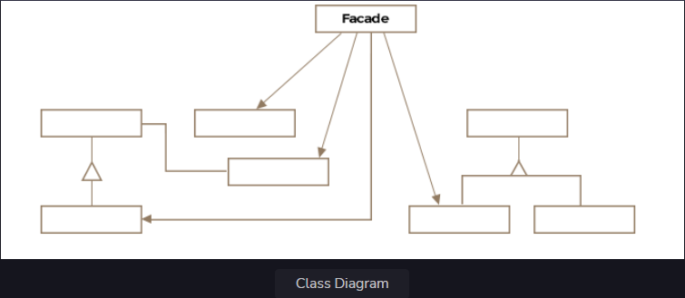

Facade Pattern
This lesson discusses how the interface to a complex system of interacting entities can be simplified by providing a
front that hides the subsystem intricacies from the client.

We'll cover the following

What is it ?
Class Diagram
Example
Other Examples
Caveats
What is it ?
A facade literally means the front of a building or an outward appearance to hide a less pleasant reality. The facade
pattern essentially does the same job as the definition of the word facade. Its purpose is to hide the complexity of an
interface or a subsystem.

If you take a look around the amenities of current life, almost everything is a facade. When you press a button to turn
on the room lights. The button is a facade that hides from you the complexities of electric power generation and
distribution and magically lights up your room. The facade makes complex systems easier to use.

Formally the facade pattern is defined as a single uber interface to one or more subsystems or interfaces intending to
make use of the subsystems easier.

Class Diagram
The class diagram consists of the following entities

Facade
Subsystem Classes
Class Diagram
Class Diagram

Example
Modern aircrafts have a feature called autopilot that allows the airplane to fly to its destination in an automated
fashion without much interference from human pilots. The autopilot feature needs to juggle with all the subsystems and
health-checks of the aircraft to ensure a smooth flight. It can hide away all the underlying complexity of automated
flight from a pilot. Let's look at how the Boeing autopilot facade would be created:

public class AutopilotFacade {

    private BoeingAltitudeMonitor altitudeMonitor;
    private BoeingEngineController engineController;
    private BoeingFuelMonitor feulMonitor;
    private BoeingNavigationSystem navigationSystem;

    public AutopilotFacade(BoeingAltitudeMonitor altitudeMonitor, BoeingEngineController engineController,
                           BoeingFuelMonitor feulMonitor, BoeingNavigationSystem navigationSystem) {
        this.altitudeMonitor = altitudeMonitor;
        this.engineController = engineController;
        this.feulMonitor = feulMonitor;
        this.navigationSystem = navigationSystem;
    }

    public void autopilotOn() {
        altitudeMonitor.autoMonitor();
        engineController.setEngineSpeed(700);
        navigationSystem.setDirectionBasedOnSpeedAndFeul(
                engineController.getEngineSpeed(),
                feulMonitor.getRemainingFeulInGallons());
    }

    public void autopilotOff() {
        altitudeMonitor.turnOff();
        engineController.turnOff();
        navigationSystem.turnOff();
        feulMonitor.turnOff();
    }

}
The facade is encapsulating the logic required to activate and deactivate the autopilot in the autopilotOn and
autopilotOff methods. It is also being passed in all the subsystems required in its constructor. We have intentionally
left out the implementation for the subsystems BoeingAltitudeMonitor, BoeingEngineController, BoeingFuelMonitor and
BoeingNavigationSystem for brevity. The key point to understand here is that these subsystems expose certain operations
that are hidden behind an interface that lumps their execution in the right sequence.

You may argue that the class Boeing747 could have just as well invoked the required methods on the subsystem objects and
you are right. The intent is not to hide the subsystems but to make it easier to use the collection of subsystems. The
Boeing747 class only works with the facade. It codes against the facade rather than individual subsystems so that
tomorrow if any subsystem is switched out for a better one the change is quarantined to the facade and doesn't cascade
across the code base.

The facade pattern shields the client from having to deal with all the complex subsystem classes, thus creating a loose
coupling between the subsystem and its clients. Upon receiving a request, the facade forwards the request to the
appropriate subsystem and may do any necessary translation inbetween.

Other Examples
Class javax.faces.context.FacesContext internally uses other types like LifyCycle and ViewHandler, so that the end user
doesn't deal with them directly.

javax.faces.context.ExternalContext internally uses the HttpSession, HttpServletRequest and other classes. It acts as a
facade for the consumers of the underlying classes.

Caveats
Usually a single facade object is needed and is implemented as a singleton.