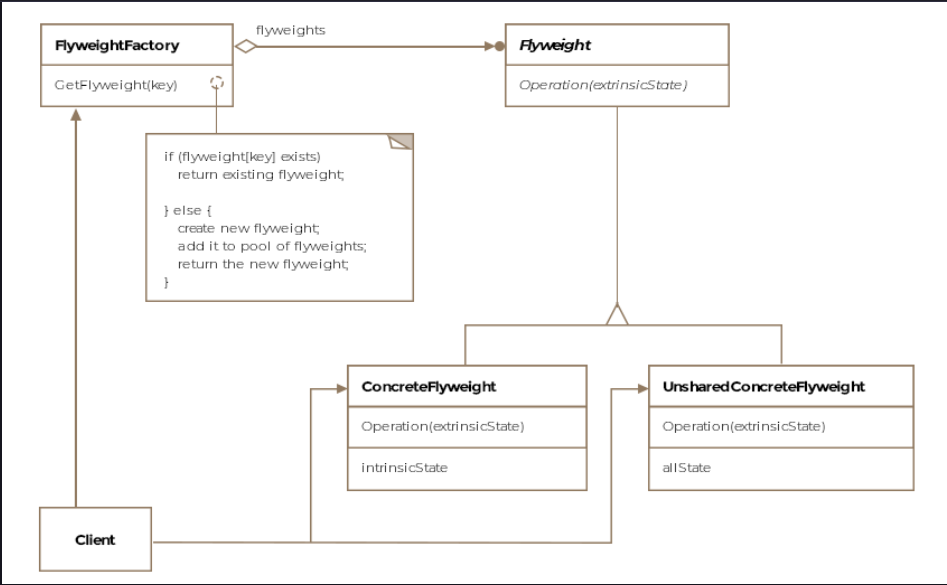

Flyweight
This lesson discusses how the flyweight pattern can be applied to reduce memory requirements.

We'll cover the following

What is it ?
Class Diagram
Example
Other Examples
Caveats
What is it ?
Flyweight is a category in boxing competitions for light weight boxers. The intent of the pattern is somewhat similar in
that it tries to reduce bloated code to a more compact and lean representation, which uses less memory.

Formally, the pattern is defined as sharing state among a large number of fine-grained objects for efficiency.

Class Diagram
The class diagram consists of the following entities

Flyweight
Concrete Flyweight
Unshared Concrete Flyweight
Flyweight Factory
Client
widget

Example
Following OO principles to the core may lead you to create too many objects in your application that have part of their
state shared. For instance, continuing with our aircraft scenario, if you are designing a global radar that tracks all
the planes currently airborne in the world at any time then your radar screen will show thousands of airplanes
represented as objects in memory. If your hardware is limited in memory then you have a problem.

Each object would have some shared state that is independent of where the plane is flying in the world. This state which
is independent of the context of the plane is called intrinsic state and can be factored out and shared amongst all
similar planes. The state of the plane which changes with the context is called the extrinsic state. In this case, the
coordinates of the plane will change for each plane and can be thought of as the extrinsic state. The remaining amount
of fuel for each airplane is another piece of information that is extrinsic. However, the number of crew required to fly
a particular variant of the F-16 would be the same across all the F-16s of that variant that are airborne. This would be
an example of intrinsic state. The crew number isn't dependent on the context, i.e. which part of the world is the plane
flying in, which country does it belong to, is it on a patrolling mission or a combat mission etc - none of that affects
or changes the number of people required to operate the aircraft.

Using the flyweight pattern, we can move the extrinsic state of the object outside of the class and only keep the
intrinsic state within the class. This change would allow us to reuse the same F-16 object for all the F-16s that are
currently airborne and show up on the radar. The number of objects required to represent the flying F-16s would
drastically reduce. The extrinsic state of the planes can always be passed-in to the methods that use it.

The astute reader would immediately question where do we keep the extrinsic state? That can be kept in a separate
context object. But then you may retort that it is like going back to square one, for now, we are creating more objects
and the whole purpose of the pattern was to reduce the number of objects. Your observation is correct, however, note
that the context object only contains that information which varies per instance of F-16. The information which is
common across the F-16 instances is stored in a flyweight object. Earlier, we had a single heavyweight object that
contained both kinds of information and was needed per instance of F-16. With the break-up, the single heavyweight
object becomes a flyweight object used by all F-16s consisting of information that'll not change and an additional
context object per F-16 instance consisting of information that'll change for each instance of the F-16. Since we are
keeping a single copy of the non-varying information, we'll witness memory savings.

Let's see how the F-16 flyweight class would look like

public class F16 implements IAircraft {

    // Intrinsic state
    private final String name = "F16";
    private final int personnel = 2;
    private final String dimensions = "15m long 3m wide";
    private final String wingspan = "33 feet";

    // Extrinsic state includes the current position and current speed
    // of the aircraft that is being passed in for computing remaining
    // time to destination
    public double getTimeToDestination(int currX, int currY, int destX, int destY, int currSpeed) {

        // algorithm to calculate the remaining time to reach
        // destination.

        return 1;
    }

}
The client code can take advantage of the flyweight like so:

public class Client {

    public void main(int[][] coordsF16) {

        F16 flyweightF16 = new F16();

        for (int i = 0; i < coordsF16.length; i++) {
            int currX = coordsF16[i][0];
            int currY = coordsF16[i][1];

            // We are passing in the extrinsic state to the flyweight object. Note we are storing the
            // extrinsic state of the airborne f16s in a 2-dimensional array.
            System.out.println("time to destination = " +
                               flyweightF16.getTimeToDestination(currX, currY, 10, 10, 200));
        }

    }

}
Note, how the client is receiving the extrinsic state for each of the F-16 in a two-dimensional array. The flyweight F16
class has information specific to a F-16 plane that won't change. For brevity's sake the getters for the private fields
are skipped.

Other Examples
GoF discusses a text editor example. In the extreme case, each character can be represented as an object. However, any
reasonably sized document would then become bloated with character objects. Each object would contain the font, style,
color and the character encoding. For simplicity, if the document is limited to ASCII characters then we can have
flyweight objects represent each character in the ASCII table.

Methods java.lang.Boolean.valueOf and java.lang.Integer.valueOf both return flyweight objects.

Caveats
Usually, we don't want the clients to creat the flyweight objects directly. A flyweight factory is used to manage the
flywieght objects.

It might appear that flyweight pattern is maybe similar to the singleton pattern, however there are some important
differences. Flyweights are immutable whereas a singleton can undergo changes. Also, a singleton can only have a single
copy whereas flyweights can have more than one object of their type.

State and Strategy objects are often implemented as flyweights.

In practice, composite pattern can be combined with flyweight to create a hierarchical structure, where the leaves are
implemented as flyweight objects and are shared.

Since flyweight objects are shared, identity tests for conceptually different objects would return true.

Memory savings increase if the extrinsic state can be computed rather than being stored. However, the calculation or
lookup of the extrinsic state trades execution time increase in lieu of memory savings.