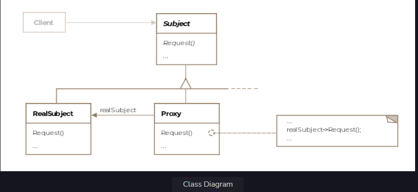

Proxy Pattern
This lesson discusses how objects can act on behalf of other objects without the clients knowing they aren't talking to
the intended object.

We'll cover the following

What is it ?
Class Diagram
Remote Proxy
Virtual Proxy
Protection Proxy
Example
Other Examples
Caveats
What is it ?
The literal definition of proxy is the authority to represent someone else. In a proxy pattern setup, a proxy is
responsible for representing another object called the subject in front of clients. The real subject is shielded from
interacting directly with the clients. There could be several reasons why one would want to front a subject with a
proxy, some are listed below:

To access remote objects over the internet, running in another JVM or another address space

To protect a subject from clients not authorized to access it

To stand in place of an object that may be expensive to create and delay the object's creation till it is accessed

To cache queries or results from subject for clients

There are a number of other use cases such as the firewall proxy, synchronization proxy etc.
Formally, the pattern is defined as a mechanism to provide a surrogate or placeholder for another object to control
access to it.

Class Diagram
The class diagram consists of the following entities

Proxy
Subject
Real Subject
Class Diagram
Class Diagram

Remote Proxy
An ambassador appointed by a country to another acts like a proxy for his/her country. He or she acts as the
communication channel between the host country and the ambassador's country. A remote proxy acts in a somewhat similar
fashion and facilitates interaction between the client and the subject. A remote proxy stands in place of an object
which isn't running on the same machine or JVM. The client doesn't know that it is not talking to the subject but a
proxy. The proxy and the subject implement the same interface allowing the client to invoke the same methods on the
proxy as it would have invoked on the subject. The proxy then sends the request for the method invocation along with the
method arguments over the network to the remote subject.

The subject doesn't have the intelligence built into it to receive the method invocation request over the network and
usually, a helper entity runs alongside the remote subject and handles network communication on behalf of the subject.
Once the method invocation request is received, the helper entity forwards it to the subject, which in turn executes the
method with the passed-in arguments. The results are then ferried back over the network to the proxy. The proxy in turn
returns the results to the client.

Virtual Proxy
A virtual proxy creates objects on demand. Sometimes creation of an object is expensive and complex and should only be
created when required. A virtual proxy delays creation of its subject until required and stands in its place before and
during its construction.

Think of instagram running on a very weak internet connection on a mobile phone. The pictures aren't loaded quickly
enough but to ensure a pleasant user experience, a loading widget can appear on the mobile screen while the image gets
downloaded in the background. The loading widget would act as a proxy for the picture and might have related information
about the picture such as the dimensions of the picture, which it can provide to the display frame before the picture
download is complete.

Protection Proxy
A protection proxy or authorization proxy controls access to the real subject. Requests are vetted for authorization
before being forwarded to the real subject. These proxies are useful when clients should have different access rights to
the subject.

Example
We'll show a simple example of a remote proxy.

Consider a drone that is being flown by a pilot on the ground. The drone can be thought of as the subject, while the
ground cockpit can consist of a proxy that receives actions from the physical controls in the cockpit and forwards them
to the remote drone's software.

The DroneProxy and the actual subject Drone will both implement the same interface IDrone. The client will talk with the
drone proxy without knowing that it is not talking to the real subject. The drone proxy would in turn forward requests
from the client to the real drone object running in the flying drone's computer memory over a wireless connection. The
action taken on the ground by the pilot against the drone proxy will be mimicked by the flying drone.

The simplistic drone interface can be:

public interface IDrone {

    void turnLeft();

    void turnRight();

    void firstMissile();

}
The code for the DroneProxy appears below:

public class DroneProxy implements IDrone {

    @Override
    public void turnLeft() {
        // forward request to the real drone to
        // turn left over the internet
    }

    @Override
    public void turnRight() {
        // forward request to the real drone to
        // turn right over the internet
    }

    @Override
    public void firstMissile() {
        // forward request to the real drone to
        // fire missile
    }

}
The client code will be like so:

public class Client {

    public void main(DroneProxy droneProxy) {

        // perpetual loop that received pilot actions
        while (true) {

            Scanner scanner = new Scanner(System.in);
            String action = scanner.nextLine();

            switch (action) {
            case "left": {
                droneProxy.turnLeft();
                break;
            }

            case "right": {
                droneProxy.turnRight();
                break;
            }

            case "fire": {
                droneProxy.firstMissile();
                break;
            }

            default:
                System.out.println("Invalid Action");
            }
        }
    }

}
The object of class Drone which will be part of the code that runs on the hardware of the flying drone and controls its
flight may look like below:

public class Drone implements IDrone {

    @Override
    public void turnLeft() {
        // receives the request and any method parameters
        // over the internet to turn the drone to its left.
    }

    @Override
    public void turnRight() {
        // receives the request and any method parameters
        // over the internet to turn the drone to its right.
    }

    @Override
    public void firstMissile() {
        // receives the request and any method parameters
        // over the internet to fire a missile
    }

}
Note we have skipped the technological details for transmitting the request and the method parameters over the wire as
they may vary from language to language and don't affect the spirit of the pattern.

Other Examples
java.lang.reflect.Proxy is an example of the proxy pattern.

java.rmi.* package contains classes for creating proxies. RMI is Remote Method Invocation. It is a mechanism that
enables an object on one Java virtual machine to invoke methods on an object in another Java virtual machine. RMI uses
marshalling to send method parameters over the wire and the subject unmarshalls them back into objects.

Caveats
A proxy may also be responsibile for additional house-keeping tasks such as deleting the subject, keeping a reference
count to the real subject or encoding requests before sending them to the real subject over the wire.