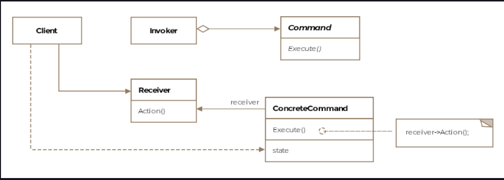

Command Pattern
This lesson discusses how actions and requests can be encapsulated as objects to act as callbacks and in the process
allow logging, queueing and undo of commands.

We'll cover the following

What is it ?
Class Diagram
Example
Macro Command
Other Examples
Caveats
What is it ?
The command pattern's intention is to decouple the consumers of an action and the object which knows how to perform the
action. Let me present an example for clarity. Suppose you are designing a framework for UI, and you add the ability for
the users of the framework to add a menu bar. The menu bar will consist of menu-items. When someone clicks on the
menu-item some action will be performed. Since you are only building the framework, you don't know what actions the
users of the framework can have the menu-item perform. It may vary from opening a document to restarting the
application. The command pattern allows us to encapsulate the desired action in an object and the object becomes
responsible for invoking the action with the appropriate arguments.

Formally, the pattern is defined as representing an action or a request as an object that can then be passed to other
objects as parameters, allowing parameterization of clients with requests or actions. The requests can be queued for
later execution or logged. Logging requests enables undo operations.

Class Diagram
The class diagram consists of the following entities

Command
Concrete Command
Client
Invoker
Receiver
Class Diagram
Class Diagram

Example
Going back to our aircraft example, imagine the cockpit of the Boeing-747. It has a multitude of instrument panels with
knobs and buttons. For simplicity's sake let's say the plane has a button for the landing gear (the wheels of the
aircraft), which allows the landing gear to be lowered or retracted. The button shouldn't need to know how the landing
gear works, it just needs to know who has the knowledge to operate the landing gear. The who part will implement the
Command interface and the button will know it needs to invoke the execute method on the who object.

Let's look at the code implementation of our simplistic scenario. First up is the command interface:

public interface Command {
void execute();
}
When the button is pressed to say lower the landing gear. The button code should only have to deal with a command object
that implements the Command interface. The button code simply calls execute on the command object. Let's look at the
LandingGearDownCommand class.

public class LandingGearDownCommand implements Command {

    // This is called the receiver of the request and
    // actually has the logic to perform the action
    LandingGear landingGear;

    public LandingGearDownCommand(LandingGear landingGear) {
        this.landingGear = landingGear;
    }

    @Override
    public void execute() {
        landingGear.up();
    }

}
You'll see the variable landingGear in the LandingGearDownCommand class. This is called the Receiver. It is the object
that actually knows how to lower the landing gear and does the job, which is why it is called the receiver because it
receives the request and processes it. The LandingGearDownCommand is the Command in pattern-speak. The command is
composed with the receiver that actually contains the logic to perform the requested action

You must be wondering that LandingGearDownCommand object needs to be instantiated somewhere in the code. The Invoker
takes on the responsibility of creating the command object and invoking it. In our case, we can imagine a class
representing the instrument panel which holds all the commands for the physical buttons on the panel. It may look
something like:

public class InstrumentPanel {

    // Only two commands for now
    Command[] commands = new Command[2];

    public InstrumentPanel() {

    }

    public void setCommand(int i, Command command) {
        commands[i] = command;
    }

    public void lowerLandingGear() {
        // Assuming that the client correctly sets the first
        // index to be the landing gear lower command
        commands[0].execute();
    }

    public void retractLandingGear() {
        commands[1].execute();
    }

}
Notice how the Invoker is simply setting up the commands and then invoking the execute method on the command objects. We
can very well replace the command object with an instance of a different implementation and the invoker would still work
correctly. This allows decoupling between the invoker and the receivers. The Command pattern decouples the object that
invokes the operation from the one having the knowledge to perform it.

The last piece to the command pattern is the client which sets up the invoker with the right commands and the commands
with the right receiver objects.

    public void main() {

        LandingGear landingGear = new LandingGear();
        LandingGearDownCommand landingGearDownCommand = new LandingGearDownCommand(landingGear);
        LandingGearUpCommand landingGearUpCommand = new LandingGearUpCommand(landingGear);

        // Create the instrument panel
        InstrumentPanel instrumentPanel = new InstrumentPanel();

        // Assign the commands
        instrumentPanel.setCommand(0, landingGearUpCommand);
        instrumentPanel.setCommand(1, landingGearDownCommand);

        // Lower the landing gear
        instrumentPanel.lowerLandingGear();

        // Retract the landing gear
        instrumentPanel.retractLandingGear();
    }

Macro Command
A series of commands can be strung together and executed in a sequence by another command object, sometimes called a
macro command. It has no explicit receiver as the commands it sequences define their own receivers. The macro command is
an example of the composite pattern.

Other Examples
java.lang.Runnable defines the interface implemented by classes whose instances are executed by threads.

Implementations of javax.swing.Action also conform to the command pattern.

Caveats
The command pattern is equivalent of a callback function in procedural languages as we parametrize objects with an
action to perform

The command objects can also be queued for later execution.

The command interface can introduce an unexecute method, which reverses the actions of the execute method. The executed
commands can then be stored in a list and traversing the list forwards and backwards while invoking execute or unexecute
can support redo and undo respectively. The memento pattern can be helpful in storing the state a command needs to undo
its effects.

The command interface can add methods to save and read from disk allowing logging of commands. In case of a crash the
log can be read and the commands re-executed in the same sequence to get the system back to the state just before the
crash.

The command pattern offers a way to model transactions. A transaction consists of finer grained operations applied to
data.