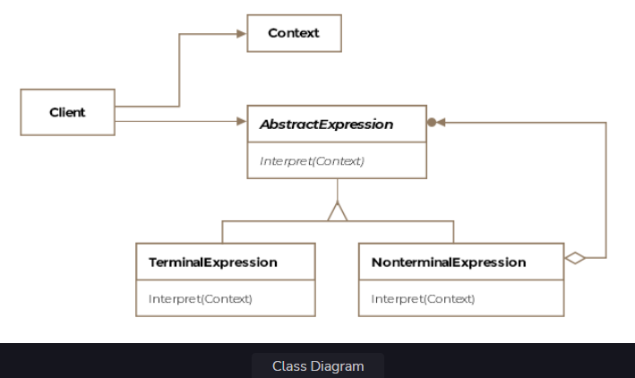
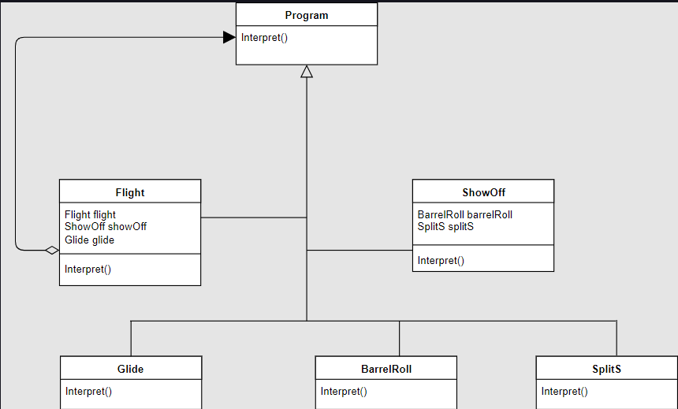
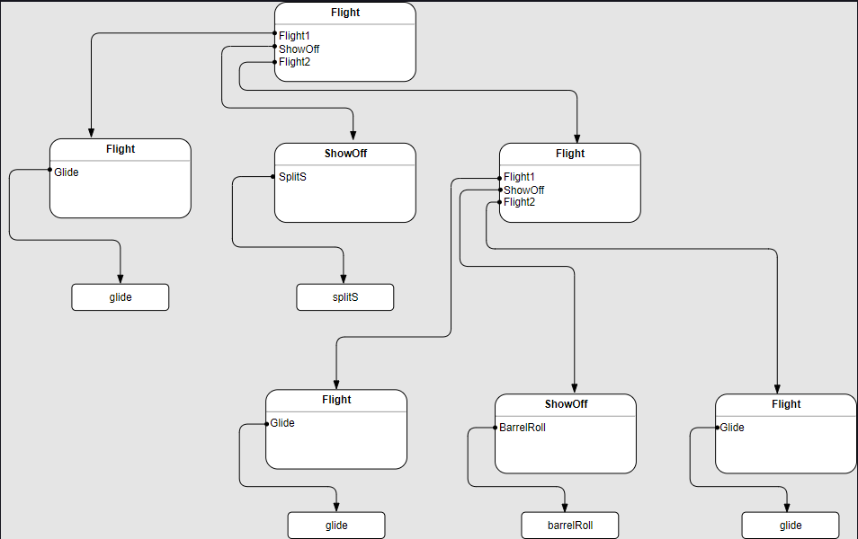

Interpreter Pattern
This lesson delves into the interpreter pattern, which allows us to simplify representation and implementation of a new
programming language albeit with limited syntax.

We'll cover the following

What is it ?
Grammar
Context Free Grammar
Connecting back
Class Diagram
Example
Abstract Syntax Tree
Tying it All Together
Other Examples
Caveats
What is it ?
The interpreter literally means a translator, someone who can convert from one form of speech to a another. The
interpreter pattern converts a language's sentences into its grammar and interprets them.

Understanding the interpreter pattern requires background knowledge in automata and theory of computation. We'll briefly
go over some of the concepts required to understand the pattern.

Grammar
Every human language has an associated grammar that defines what constructs are legal or illegal. Similarly, computer
languages are defined by grammar too. Given a snippet of code, the language defined by the grammar would determine if
the code is syntactically correct or not. There are four types of grammar known as the Chomsky's hierarchy.

Regular
Context Free
Context Sensitive
Recursively Enumerable
Context Free Grammar
We'll be interested in context free grammar for the purposes of this lesson. Most programming languages use context free
grammars to specify the syntax of a language. A syntactically correct program however may or may not compile.

A CFG consists of four components:

start symbol

a set of terminal symbols

a set of non-terminal symbols

a set of productions (rules)

Let's immediately see an example to understand what is meant by each of the above terms. Consider the below productions
or rules for an arithematic expression

<expression> --> number
<expression> --> <expression> + <expression>
<expression> --> <expression> - <expression>
<expression> --> <expression> * <expression>
<expression> --> <expression> / <expression>
The above rules say that the left hand side expression, which is a non-terminal symbol, can be expanded into the values on the right hand side. A non-terminal symbol is nothing but a variable or a placeholder which can be expanded into the right hand side values. One can recursively keep expanding the non-terminal symbols till a terminal symbol is reached. This is similar to how a recursive algorithm stops recursion once it reaches the base case, otherwise the program would continue in an infinite loop.

The arithematic CFG will have <expression> as the start symbol and + - * / number will form the set of terminals, where
number is any valid number.

As an example, we can create the following expression using the CFG

<expression>   using the start symbol
<expression> + <expression>   using the second production rule
7 + <expression> * <expression>   using the first and fourth production rules
7 + 4 * 3   using the first production rule
The string 7 + 4 * 3 is said to be in the language of the grammar that we defined.

Connecting back
With the above discussion, now we are in a better position to define the interpreter pattern. The Interpreter pattern
uses a class to represent each grammar rule. Symbols on the right-hand side of the rule are instance variables of these
classes.

Formally, the pattern is defined as describe a way to represent the grammar of a language along with an interpreter that
uses the representation to interpret sentences in the language.

Class Diagram
The class diagram consists of the following entities

Abstract Expression
Terminal Expression
Nonterminal Expression
Context
Client
Class Diagram
Class Diagram

Example
Let's say you are writing an educational programming language for kids who aspire to be pilots someday. Your language
would be very simple and will allow kids to control a plane object on-screen using the following keywords, which make up
your programming language:

[Glide]()
[SplitS]()
[BarrelRoll]()
The plane object on the screen will perform one of the three actions when reading the program script. However the
restriction is that a plane must start and end with a glide operation and can't perform stunts consecutively, i.e. the
splitS and barrelRoll must be separated by a glide operation.

The above language can be defined by the grammar below:

Flight is the start symbol and represents the program a child wrties.
Terminal symbols includes: glide, splitS, barrelRoll
Non-terminal symbols include: <Flight> and <ShowOff>
The production rules are:
<Flight> --> <Flight> <ShowOff> <Flight>
<Flight> --> glide
<ShowOff> --> splitS
<ShowOff> --> barrelRoll
Or we can express the same as below when using BNF form:

<Flight> ::= glide | <Flight> <ShowOff> <Flight>
<ShowOff> ::= splitS | barrelRoll
As an example we can generate a string from the following sequence of operations using the grammar rules:

<Flight>
<Flight> <ShowOff> <Flight>
glide splitS <Flight> <ShowOff> <Flight>
glide splitS glide barelRoll glide This sequence of commands would be considered syntactically correct for our educational programming language.
The recursion ends with the terminal symbols. Applying the interpreter pattern, we model each of the grammar rules as a class. Symbols on the right-hand side of the rule are instance variables of these classes.

Since we use Flight as both the start symbol as well as a non-terminal symbol, we can introduce an abstract Program
class from which all the other classes derive. The Program class has an abstract method interpret() that all derived
classes implement and is required by the pattern.

The class diagram for the language defined by the grammar would look like below:

svg viewer

Abstract Syntax Tree
Abstract syntax trees (AST) are widely used in compilers to represent the structure of a program. Don't confuse the
abstract to mean an abstract class or interface. Without getting into too much detail, the takeaway is that all the
language strings produced by a grammar can be represented as an abstract syntax tree. The tree nodes would be the
classes we created from the grammar rules. The internal nodes will be non-terminal symbols and the leaves must
necessarily be terminal symbols. Lets take the string we generated earlier glide splitS glide barelRoll glide and see
how its AST would look like.

svg viewer

Tying it All Together
Each of our subclass implements the interpret(Context) method. Interpret takes as an argument the context in which to
interpret the expression. Each interpret operation of the terminal symbols defines the base case for recursion. The
context contains the input string and information on how much of it has been matched so far. Each subclass of Program
implements Interpret to match the next part of the input string based on the current context. For instance:

The classes Glide, BarrelRoll and SplitS will check to see if the input matches any of those words.

The class ShowOff will check if the input matches either of the two values it can take on.

The class Flight class will check if the input matches the terminal symbol or expands into another concatenation of
non-terminal symbols.

We'll skip the implementation that'll contain the logic for matching the input stream as its not necessary to understand
the pattern.

The listing for the classes appears below

public abstract class Program {
public void interpret(Context context) {}
}

public abstract class Flight extends Program {

    Flight flight;
    ShowOff showOff;
    Glide glide;

    @Override
    public void interpret(Context context) {}

}

public class ShowOff extends Program {

    BarrelRoll barrelRoll;
    SplitS splitS;

    @Override
    public void interpret(Context context) {

    }

}

public class BarrelRoll extends Flight {

    @Override
    public void interpret(Context context) {

    }

}

public class Glide extends Program {

    @Override
    public void interpret(Context context) {

    }

}

public class SplitS extends Program {

    @Override
    public void interpret(Context context) {

    }

}
The client will use pattern like below:

public class Client {

    public void main(AbstractSyntaxTree ast) {

        Context context = new Context("glide splitS glide barelRoll glide");

        while (ast.hasNext()) {
            Program node = ast.getNextNode();
            node.interpret(context);
        }
    }

}
Other Examples
java.util.Pattern is a compiled representation of a regular expression.

java.text.Normalizer provides functionality to transform Unicode text.

Caveats
The interpret() method can also be put in a visitor object instead of putting it in the expression classes.

The terminal symbols can also implemented as flyweight objects.

Its easy to implement, extend and change grammars with limited rules that are implemented using the interpreter pattern.
However grammars will lots of rules become hard to manage since there's one class per rule in the interpreter pattern.