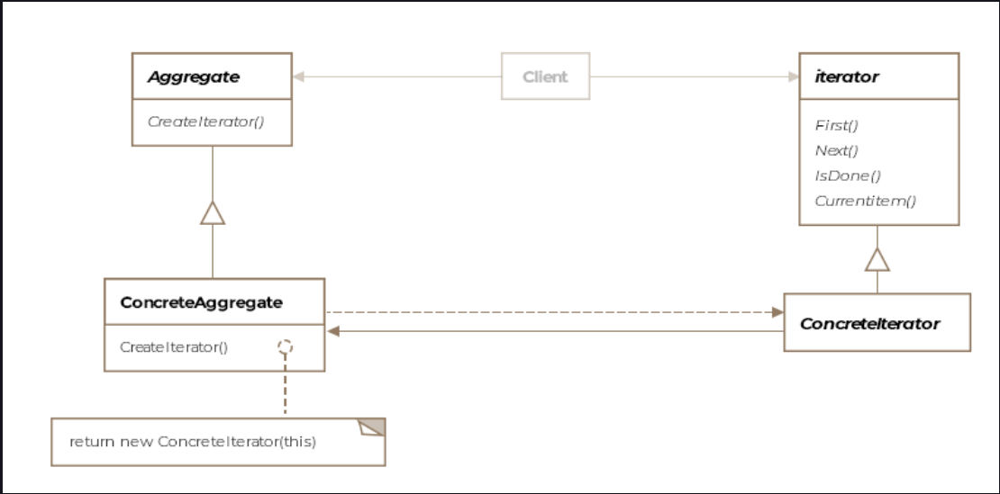

Iterator Pattern
This lesson discusses how the underlying elements that make up an aggregate object can be looped through without
exposing implementation details to clients.

We'll cover the following

What is it ?
Class Diagram
Example
Internal vs External Iterator
Other Examples
Caveats
What is it ?
Iterate literally means to perform repeatedly. A for loop iterates over an array i.e. it accesses the array repeatedly.
If you are familiar with Java then you would already have come across this pattern while working with Java Collections.
A brief demonstration is below.

        ArrayList<String> companiesIWantToInterviewFor = new ArrayList<>();
        companiesIWantToInterviewFor.add("SnapChat");
        companiesIWantToInterviewFor.add("Twitter");
        companiesIWantToInterviewFor.add("Tesla");

        Iterator<String> it = companiesIWantToInterviewFor.iterator();
        while (it.hasNext()) {
            System.out.println(it.next());
        }

The iterator allows a consumer to go over the elements of a collection without knowing how the collection is
implemented. A collection can be a list, array, arraylist, hashmap or any other fancy datastructure. A collection
signifies a bunch of objects. It doesn't specify any ordering or properties about the objects it holds. An iterator is
formally defined as a pattern that allows traversing the elements of an aggregate or a collection sequentially without
exposing the underlying implementation.

The iterator pattern extracts out the responsibility of traversing over an aggregate out of the aggregate's interface
and encapsulates it in the iterator class, thereby simplifying the aggregate's interface.

Class Diagram
The class diagram consists of the following entities

Iterator
Concrete Iterator
Aggregate
Concrete Aggregate

widget
Example
Java already has an interface Iterator but for the purposes of learning, we'll create it from scratch. Our interface
will expose only two methods next() and hasNext(). It'll look something like below:

public interface Iterator {

    void next();

    boolean hasNext();

}
Lets say we have a class AirForce and it contains different kinds of aircraft, some are cargo airplanes, others are
fighter jets and a few helicopters. Objects for each of these aircraft types are stored in different collection types.
Take a minute to go over the Airforce class listing below:

public class AirForce {

    List<IAircraft> jets = new ArrayList<>();
    IAircraft[] helis = new IAircraft[1];
    LinkedList<Boeing747> cargo = new LinkedList<>();

    public List<IAircraft> getJets() {
        return jets;
    }

    public IAircraft[] getHelis() {
        return helis;
    }

    public LinkedList<Boeing747> getCargo() {
        return cargo;
    }

    public AirForce() {
        jets.add(new F16());
        helis[0] = new CobraGunship();
        cargo.add(new Boeing747());
    }

    // This method returns a concrete iterator that
    // traverses over the entire airforce planes.
    public Iterator createIterator() {
        return new AirForceIterator(this);

    }

    // This method returns a different concerete iterator
    // that traverses over only the jets in the airforce.
    public Iterator createJetsIterator() {
        return new JetsIterator(jets);

    }

}
Note the methods createIterator() and createJetsIterator() return objects that implement the Iterator interface. Notice
how each kind of aircraft is stored in a different type of collection. If a client needs to list all the aircraft in an
airforce object, it'll have a hard time invoking getters and then going over each individual collection. We mask this
complexity by creating an iterator class whose sole job is to list all the aircraft held by the airforce. Look at the
implementation below:

public class AirForceIterator implements Iterator {

    List<IAircraft> jets;
    IAircraft[] helis;
    LinkedList<Boeing747> cargo;
    int jetsPosition = 0;
    int helisPosition = 0;
    int cargoPosition = 0;

    /**
     * The iterator is composed with the object it'll be iterating over
     */
    public AirForceIterator(AirForce airForce) {
        jets = airForce.getJets();
        helis = airForce.getHelis();
        cargo = airForce.getCargo();

    }

    @Override
    /**
     * We provide our own custom logic of returning aircraft in a
     * sequence. Note we are returning IAircraft interface object which
     * every plane in our airforce implements. We also design the function
     * to throw a runtime exception if next is invoked when no more elements
     * are left to iterate over
     */
    public IAircraft next() {

        // return helis first
        if (helisPosition < helis.length) {
            return helis[helisPosition++];
        }

        // return jets second
        if (jetsPosition < jets.size()) {
            return jets.get(jetsPosition++);
        }

        // return cargos last
        if (cargoPosition < cargo.size()) {
            return cargo.get(cargoPosition++);
        }

        throw new RuntimeException("No more elements");

    }

    @Override
    public boolean hasNext() {

        return helis.length > helisPosition ||
               jets.size() > jetsPosition ||
               cargo.size() > cargoPosition;
    }

}
Let's look at how the client uses the iterator

public class Client {

    public void main() {

        AirForce airForce = new AirForce();

        Iterator jets = airForce.createJetsIterator();

        while (jets.hasNext()) {
            jets.next();
        }

        Iterator allPlanes = airForce.createIterator();

        while (allPlanes.hasNext()) {
            allPlanes.next();
        }
    }

}

Notice, the client has no idea about how the different airplane types are held in the airforce object nor does it know
what type of aircraft they are. It simply gets to work with the IAircraft interface.

The Java API has its own iterator interface which also includes remove() and forEachRemaining() methods that we have not
included in our in-house iterator.

Internal vs External Iterator
When the iteration control rests with the client using the iterator, that is, the client is responsible for advancing
the traversal and explicitly requesting the next element from the iterator, it is an example of an external iterator.
Iterators in our aircraft example are external iterators. On the other hand, when the client hands the iterator an
operation to perform and the iterator performs the operation on each element of the aggregate, it is an example of an
internal iterator.

Other Examples
In Java several classes directly or indirectly implement the Iterator interface. By indirect implemenation, it is
implied that a class implements an interface that extends the Iterator interface.

Another example one can think of is in case of tree datastructure. One can parametrize the createIterator() method to
yield iterators which traverse the tree in preorder, inorder or postorder.

java.util.Scanner class is another example of the iterator pattern.

java.util.Enumeration interface although deprecated but is an early example of the iterator pattern in Java.

Caveats
Note that there could be more than one pending traversals on the aggregate. Each iterator would store its own traversal
state. The iterator can apply the memento pattern to store the traversal state.

By moving the traversal outside of the aggregate, it's easier to provide variations on the traversal algorithm to the
client.

Special care needs to be taken care when insertions or deletions are allowed to an aggregate amidst an on-going
traversal. The iterator can either skip over a new element or iterate over the same element twice.

For composites as described in the Composite Pattern, it might make sense to create internal iterators instead of
external ones, reason being that the composite can have several levels of aggregate structures and its easier for the
composite to internally keep track of the traversal position by calling itself recursively and implicitly storing the
traversal path in the call stack.