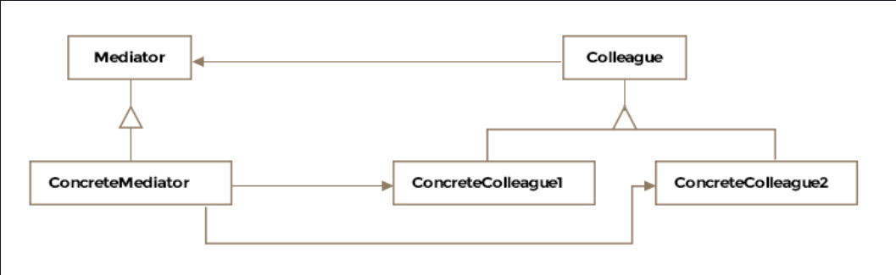

Mediator Pattern
This lesson discusses how the mediator pattern centralizes interaction amongst a number of interacting objects reducing
coupling and dependence among them.

We'll cover the following

What is it ?
Class Diagram
Example
Other Examples
Caveats
What is it ?
A mediator is defined as a person who makes people involved in a conflict come to an agreement. The pattern definition
however, isn't violent and says the pattern is applied to encapsulate or centralize the interactions amongst a number of
objects. Object orientated design may result in behavior being distributed among several classes and lead to too many
connections among objects. The encapsulation keeps the objects from referring to each other directly and the objects
don't hold references to each other anymore.

Formally, the pattern is defined as encouraging loose coupling among interacting objects by encapsulating their
interactions in a mediator object, thus avoiding the need for individual objects to refer to each other directly and
allowing to vary object interactions independently.

A mediator controls and coordinates the behavior for a group of objects. The objects only communicate with the mediator
or the director and don't know of the other objects.

The mediator pattern should be applied when there are many objects communicating in a well-structured but complex manner
resulting in interdependencies that are hard to understand. The participant objects in such a scheme don't lend
themselves for reuse because of dependence on so many other objects.

Since the interaction rules or behavior is isolated in a single mediator class, it becomes easier to change. Also note
that in the absence of the mediator, the objects are engaged in many-to-many interactions but when the mediator is
introduced the interactions become one-to-many between the mediator and the other participating objects.

Class Diagram
The class diagram consists of the following entities

Mediator
Concrete Mediator
Colleague Classes
Class Diagram
Class Diagram

Example
Imagine an airport without an air-traffic control tower. All the airplanes in flight, about to land and about to
take-off need to be aware of every other airplane to coordinate the use of the runways as well as the airspace. There
are in a sense dependent on each other to avoid a disaster but this leads to having too many interconnections among
objects. With a single runway, the worst case is every airplane has to know about every other airplane about to land or
take-off to avoid collisions. The control tower object can act as a mediator and communication hub for all the airplanes
and ensure a smooth working of the airport.

For instructional purposes, we'll implement the coordination logic required for an airplane to land safely. The
ControlTower class appears below:

public class ControlTower {

    List<IAircraft> queuedForLanding = new ArrayList<>();

    // An aircraft just notifies the control tower that it wants to
    // land and doesn't coordinate with other aircraft
    synchronized public void requestToLand(IAircraft aircraft) {
        queuedForLanding.add(aircraft);
    }

    public void run() {

        // perpetual loop
        while (true) {

            // inefficient busy wait till aircraft requests to land
            while(queuedForLanding.size() == 0);

            IAircraft aircraft;
            synchronized (this) {
                aircraft = queuedForLanding.remove(0);
            }
            // We have only one runway available so only allow a single
            // aircraft to land.
            aircraft.land();
        }
    }

}
The aircraft interface and classes are:

public interface IAircraft {

    public void land();

}

public class F16 implements IAircraft {

    ControlTower controlTower;

    public F16(ControlTower controlTower) {
        this.controlTower = controlTower;
    }

    @Override
    public void land() {
        System.out.println("F16 landing...");
    }

    public void requestControlTowerToLand() {
        controlTower.requestToLand(this);

    }

}

In our naive example the aircraft object communicates with the ControlTower class and requests to land. The control
tower object maintains a queue of planes wishing to land and runs a perpetual thread-safe loop that allows each plane to
land one after the other. If the number of runways available increases or close down for maintenance, the changes are
localized to the ControlTower class.

We used the control tower example also for the observer pattern and it applies in the mediator pattern too as the
interaction between the mediator and the colleagues can be modeled on the observer pattern.

Other Examples
java.util.concurrent.ExecutorService an Executor that provides methods to manage termination and methods that can
produce a Future for tracking progress of one or more asynchronous tasks.

java.util.Timer A facility for threads to schedule tasks for future execution in a background thread. Tasks may be
scheduled for one-time execution, or for repeated execution at regular intervals.

Caveats
The communication between the mediator and other objects, called colleagues, can follow the observer pattern. The
mediator acts as the observer and receives notifications from colleagues, which act as subjects. The effects of the
change are then forwarded to other colleagues by the mediator.

The pattern trades complexity of interactions for complexity in the mediator. The mediator itself can become very
complex and hard to maintain.