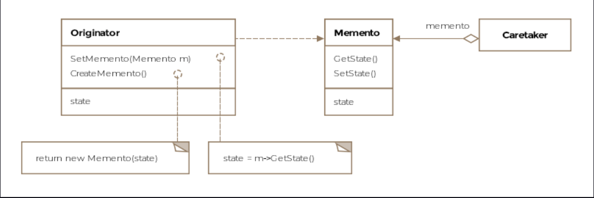

Memento Pattern
This lesson discusses how the state of an object can be exported as a snapshot without exposing the internals of the
object.

We'll cover the following

What is it ?
Details
Class Diagram
Example
Other Examples
Caveats
What is it ?
The literal meaning of memento is an object kept as a reminder or souvenir of a person or an event. The memento pattern
let's us capture the internal state of an object without exposing its internal structure so that the object can be
restored to this state later. In some sense we are saving a token or a memento of the original object and then
recreating the object's state using the memento at a later time.

Details
The object whose state we capture is called the Originator. The originator's snapshot is called the memento. The memento
object is held by another object called the Caretaker. The interaction between these three entities happens as follows:

The caretaker requests the originator for a snapshot of its internal state.

The originator produces a memento.

The memento is held by the caretaker and passed back to the originator when required to revert its state to that
captured in the memento. If that need doesn't arise, the memento is eventually discarded by the caretaker.

In the absence of the memento pattern, the originator would need to expose its complete internal state to outside
classes who can then create snapshots of the internal state of the originator at any time. However, this approach is
brittle, breaks encapsulation and any future changes in the originator's state would require corresponding changes in
the classes that consume the originator's internal state.

With the introduction of the memento, the originator itself creates a snapshot of its state and is free to store as much
or as little information as it pleases in the memento object. The memento's interface to outside classes is limited
while the originator has full access to memento's state. This prohibits external classes including the caretaker from
manipulating memento's state but allows the originator to fully access memento's state so that it can restore itself to
the checkpoint represented by the memento.

The challenge to limit memento's interface to caretaker and other external classes while at the same time making it
completely accessible to the originator may be hard in certain languages. In case of Java, static classes can be used to
achieve this effect.

Memento lets the originator entrust other objects with information it'll need to revert to a previous state without
exposing its internal structure or representations.

Class Diagram
The class diagram consists of the following entities

Memento
Originator
Caretaeker
Class Diagram
Class Diagram

Example
Modern airplanes are equipped with a device called a blackbox that stores important flight data and helps investigators
in case of crashes. Due to the sensitivity of the information, the blackbox contains, we wouldn't want to expose the
internal state of the blackbox to clients. We'll write a class mimicking the blackbox that can produce its state as a
byte stream for clients. The blackbox code appears below:

public class BlackBox implements Serializable {

    private long altitude;
    private double speed;
    private float engineTemperature;
    private static final long serialVersionUID = 1L;

    public BlackBox(long altitude, double speed, float engineTemperature) {
        this.altitude = altitude;
        this.speed = speed;
        this.engineTemperature = engineTemperature;
    }

    // Saving the state of the object as a byte stream
    public byte[] getState() throws IOException {
        ByteArrayOutputStream bos = new ByteArrayOutputStream();
        ObjectOutput out = null;
        byte[] memento = null;
        try {
            out = new ObjectOutputStream(bos);
            out.writeObject(this);
            out.flush();
            memento = bos.toByteArray();
        } finally {
            try {
                bos.close();
            } catch (IOException ex) {
                // ignore close exception
            }
        }
        return memento;
    }

    // Restoring state from memento
    public BlackBox setState(byte[] memento) throws Exception {
        ByteInputStream bis = new ByteInputStream(memento, memento.length);

        ObjectInputStream objectInputStream
                = new ObjectInputStream(bis);
        BlackBox blackBox = (BlackBox) objectInputStream.readObject();
        objectInputStream.close();
        return blackBox;
    }

}
In Java, we can use serialization to save the state of the object. We are simply required to mark our class with the
Serializable interface, which has no methods to implement. Note that in our setState method, we are returning an object
of type BlackBox that the client can then assign. In Java, we can't assign to the this keyword, whereas in C++ we can.
If it were a C++ implementation, we could have simply assigned the this variable the deserialized object, instead of
returning it.

The client will work as follows:

public class Client {

    public void main(BlackBox blackBox) throws Exception{

        // Save the state of the memento as a byte stream.
        byte[] memento = blackBox.getState();

        // Do some work.

        // Now restore the blackbox to the previous state
        blackBox = blackBox.setState(memento);

    }

}
Other Examples
java.io.Serializable all implementations of this interface would be examples of the memento pattern.

javax.faces.component.StateHolder this interface is implemented by classes that need to save their state between
requests.

Caveats
The memento pattern might not be appropriate if large amounts of information need to be copied by the originator.

Note that using the pattern, the originator is relieved of the responsibility to save its state for the client. Instead,
the onus is on the client to request a memento from the originator and manage it. The client can at a later point
request the originator to restore itself to the state represented by the memento it holds.

Imagine a simplistic video game delivered via a web-browser. The game state can be saved by the user. One possibility is
for the game to save its state per user of the game and store it on the webservers, the other is to flip the
responsibility and store the state on the user's computer. The user can request a restore of the gaming session by
loading the right memento. This allows the game's codebase to free itself of managing game states per user.

Sometimes is possible to store incremental changes or the differential between the current and previous states rather
than the entire state in the memento. This helps to reduce the space required for storing mementos.