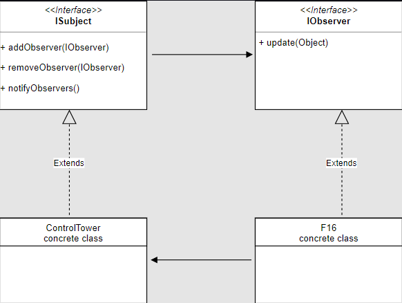
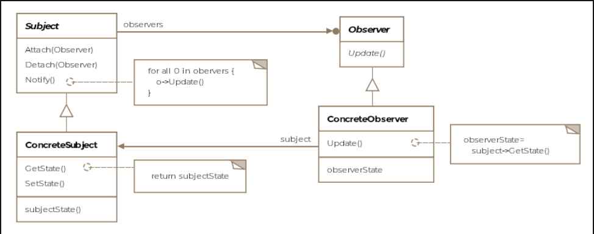

Observer Pattern
This lesson discusses how updates from an object of interest can be communicated efficiently to interested parties using
the observer pattern.

We'll cover the following

What is it ?
Class Diagram
Example
Publisher Code
Observer Code
Push vs Pull
Other Examples
Caveats
What is it ?
Social media helps us immensely in understanding the observer pattern. If you are registered on Twitter then whenever
you follow someone, you are essentially asking Twitter to send you (the observer) tweet updates of the person (the
subject) you followed. The pattern consists of two actors, the observer who is interested in the updates and the subject
who generates the updates.

A subject can have many observers and is a one to many relationship. However, an observer is free to subscribe to
updates from other subjects too. You can subscribe to news feed from a Facebook page, which would be the subject and
whenever the page has a new post, the subscriber would see the new post.

The pattern is formally defined as a one to many dependency between objects so that when one object changes state all
the dependents are notified.

Class Diagram
The class diagram consists of the following entities:

Subject
Observer
Concrete Subject
Concrete Observer
svg viewer

The class diagram in general is shown below.

widget
To ensure loose coupling we'll define an interface for the subject and one for the observer.

public interface ISubject {

    void addObserver(IObserver observer);

    void removeObserver(IObserver observer);

    void notifyObservers();

}

public interface IObserver {

    void update( Object newState);

}
The interfaces are almost self-explanatory. A concrete subject or publisher needs to implement ISubject and an observer
needs to implement IObserver.

Example
Going back to our aircraft example, we can say that any aircraft in flight would be interested in updates from the
air-traffic controller. We can imagine that an aircraft, as soon as, it is airborne would want to subscribe to updates
from the air traffic controller and unsubscribe when it lands.

Publisher Code
We create a control tower class which acts as a publisher for all aircraft.

public class ControlTower implements ISubject {

    // The ControlTower maintains a list of
    Collection<IObserver> observers = new ArrayList<>();

    @Override
    public void addObserver(IObserver observer) {
        observers.add(observer);

    }

    @Override
    public void removeObserver(IObserver observer) {
        // Logic to remove the observer goes in here
    }

    @Override
    public void notifyObservers() {
        for (IObserver observer : observers) {
            // We are passing null for state here but we
            // could pass 'this' the subject itself or a
            // type representing the state. These two options
            // represent the Pull vs Push models
            observer.update( null);
        }
    }

    /**
     * This is hypothetical function that runs perptually, gathering
     * runway and weather conditions and notifying all observers of
     * them periodically.
     */
    public void run() {

        while (true) {
            // get new runway/weather conditions and update observers
            // every five minutes
            // Thread.sleep(1000 * 60 * 5)
            notifyObservers();
        }
    }

}
Observer Code
The F-16 class would implement the IObservable as objects of the F-16 class would want updates from the ControlTower
class.

public class F16 implements IObserver, IAircraft {

    ISubject observable;

    public F16(ISubject observable) {
        this.observable = observable;
        observable.addObserver(this);
    }

    @Override
    public void fly() {
        System.out.println("F16 is flying ...");

    }

    @Override
    public void land() {

        // Don't forget to unsubscribe from control tower updates
        observable.removeObserver(this);
    }

    @Override
    public void update(Object newState) {
        // Take appropriate action based on newState
    }

}
Push vs Pull
Note how the F-16 class receives the new state as a type of class Object. We can pass in a more specific type if we
agree on what information gets passed. The way the code is structured, it represents the Push Model where the subject is
responsible for pushing the new state. Say if the aircraft is a helicopter, is it really interested in the runway
conditions? It's supposed to land on a helipad and may not use all the information that it gets passed for the runway.

A flip solution is that in the update method, instead of passing in the changed state, we pass in the subject object
itself. The subject-object in turn exposes getter methods for individual pieces of information it is willing to share
with the observers. The observer is now able to lookup only that information which it finds interesting. This is called
the Pull Model.

Other Examples
Frontend frameworks often involve the publisher-subscriber model, where a change in a DOM element on the webpage by a
user causes a data-structure held in the browser's memory (think javascript code) gets updated. AngularJS and KnockoutJS
frameworks are examples of this pattern.

In Java, implementations of java.util.EventListener are examples of the observer pattern.

Caveats
Some issues one needs to keep in mind while working with the observer pattern.

In case of many subjects and few observers, if each subject stores its observers separately, it'll increase the storage
costs as some subjects will be storing the same observer multiple times.

A small change in the subject, may lead to a cascade of updates for the observers and their dependent objects. If
clients invoke notify on the subject after each change, it can overwhelm the observers with updates, whereas another
option can be to batch the changes and then invoke notify on the subject.

Usually, another entity Change Manager can sit between the observers and the subject in case there are complex
dependencies between the subject and the observers.