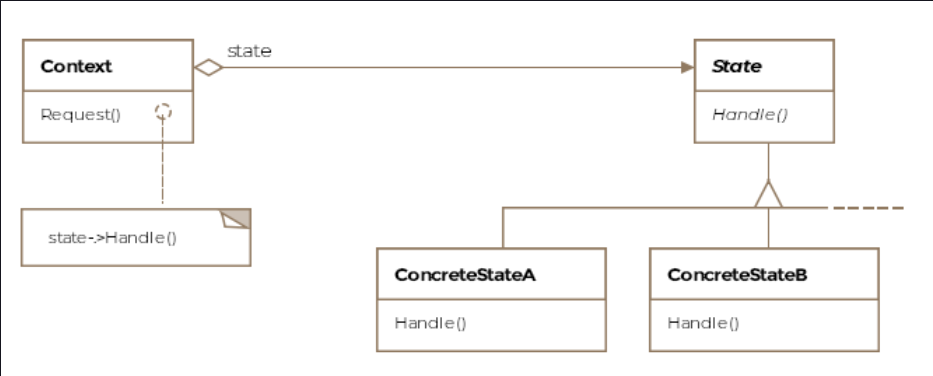
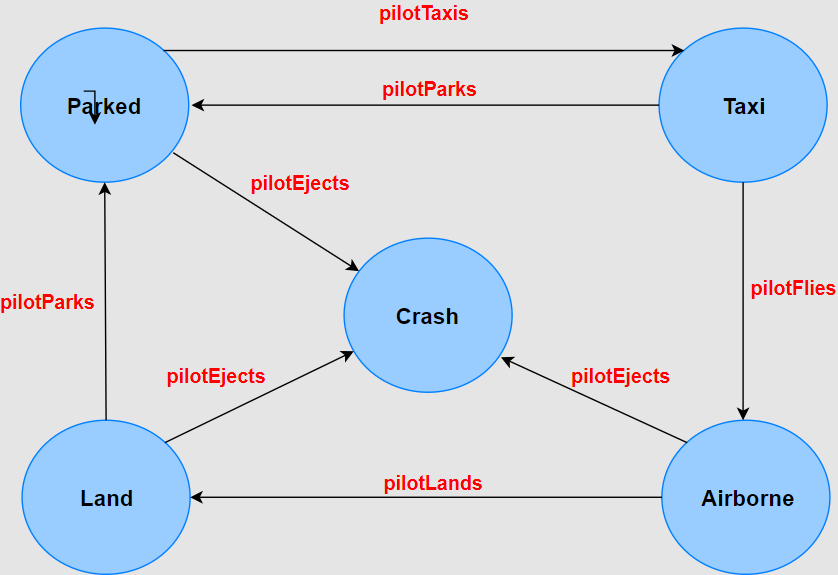

State Pattern
This lesson discusses how an object exhibits very different behavior and appears to be an instance of a different class
when its internal state changes under the state pattern.

We'll cover the following

What is it ?
Class Diagram
Example
Other Examples
Caveats
What is it ?
The state pattern will be reminiscent of automata class from your undergraduate degree as it involves state transitions
for an object. The state pattern encapsulates the various states a machine can be in. The machine or the context, as it
is called in pattern-speak, can have actions taken on it that propel it into different states. Without the use of the
pattern, the code becomes inflexible and littered with if-else conditionals.

Formally, the pattern is defined as allowing an object to alter behavior when its internal state changes so that it
appears to change its class.

Class Diagram
The class diagram consists of the following entities

Context
State
Concrete State Subclasses

widget
Example
Let's take the case of our F-16 class. An instance of the class can be in various states. Some possible states and
transitions to other states are listed below:

Current    State Possible Transitions to Other States
Parked     Crash or Taxi
Taxi       Airborne or Parked
Airborne   Crash or Land
Land       Taxi
Crash      No transition out of this state

The state transitions are depicted in the picture below:

svg viewer

The verbs in red in the state diagram are actions that propel the aircraft into different states.

Let's see how we'll write the code in the absence of the state pattern. We'll code the state transition function when
the pilot takes the taxi action.

    // Pilot takes the taxi action
    public void pilotTaxies(String currentState) {

        if (currentState == "Parked") {

            currentState = "Taxi";
            System.out.println("Plane is taxing on the runway.");

        } else if (currentState == "Airborne") {

            System.out.println("This is an invalid operation for this state");

        } else if (currentState == "Land") {

            System.out.println("This is an invalid operation for this state");

        } else if (currentState == "Crashed") {

            System.out.println("This is an invalid operation for this state");

        } else if(currentState == "Taxi"){
            System.out.println("Plane is already taxing on the runway.");
        }

    }

The method pilotTaxies captures the state transitions once the taxi action is taken by the pilot. One can see the
labyrinth of if-else conditions will only grow bigger, once we start adding more states for the plane.

Now let's see how the state pattern fixes the above problem. The state pattern will create classes for each of the
possible states and each class implements the state-specific behavior. This will result in more number of classes but
the design will become flexible and extensible as you'll shortly see. First let's capture the actions a pilot can take,
in an interface, which is the State Interface. This interface would then be implemented by the different states a F-16
can be in.

/**

* This interface defines the actions a pilot
* can take against the aircraft object. Each
* action will move the aircraft into a different
* state
  */
  public interface IPilotActions {

  void pilotTaxies(F16 f16);

  void pilotFlies(F16 f16);

  void pilotEjects(F16 f16);

  void pilotLands(F16 f16);

  void pilotParks(F16 f16);
  }
  Now let's see how a state would implement this interface. Let's start with the ParkedState. For brevity, we'll only
  show the parked state class. Each of the other states will have a corresponding class that'll code behavior for the
  F-16 in that state.

public class ParkedState implements IPilotActions {

    F16 f16;

    // Notice, how the state class is composed with the context object
    public ParkedState(F16 f16) {
        this.f16 = f16;
    }

    @Override
    public void pilotTaxies(F16 f16) {
        f16.setState(f16.getTaxiState());
    }

    @Override
    public void pilotFlies(F16 f16) {
        System.out.println("This is an invalid operation for this state");
    }

    @Override
    public void pilotEjects(F16 f16) {
        f16.setState(f16.getCrashState());

    }

    @Override
    public void pilotLands(F16 f16) {
        System.out.println("This is an invalid operation for this state");
    }

    @Override
    public void pilotParks(F16 f16) {
        System.out.println("This is an invalid operation for this state");
    }

}
Note how the constructor accepts an instance of the context and saves a reference to it. The plane can only transition
to TaxiState or CrashedState from the ParkedState. Either the pilot successfully revs up the engine and takes the plane
on the runway or he presses eject if say a fire breaks out on ignition. In our state transition model, you can see that
CrashedState is a terminal state and there are no transitions out of this state. One can't park, fly, taxi, land or
crash again a crashed plane.

The client will use our new set of classes like so:

public class Client {

    public void main() {

        F16 f16 = new F16();
        f16.startsEngine();
        f16.fliesPlane();
        f16.ejectsPlane();
        
    }

}
For completeness, the F16 class and the associated interface appear below:

public interface IAircraft {
//Empty interface
}

public class F16 implements IAircraft {

    private ParkedState parkedState = new ParkedState(this);
    private CrashState crashState = new CrashState(this);
    private LandState landState = new LandState(this);
    private TaxiState taxiState = new TaxiState(this);
    private AirborneState airborneState = new AirborneState(this);

    IPilotActions state;

    public F16() {
        state = parkedState;
    }

    void startsEngine() {
        state.pilotTaxies(this);
    }

    void fliesPlane() {
        state.pilotFlies(this);
    }

    void landsPlane() {
        state.pilotLands(this);
    }

    void ejectsPlane() {
        state.pilotEjects(this);
    }

    void parksPlane() {
        state.pilotParks(this);
    }

    void setState(IPilotActions IPilotActions) {
        state = IPilotActions;
    }

    ParkedState getParkedState() {
        return parkedState;
    }

    CrashState getCrashState() {
        return crashState;
    }

    LandState getLandState() {
        return landState;
    }

    TaxiState getTaxiState() {
        return taxiState;
    }

    public AirborneState getAirborneState() {
        return airborneState;
    }

}

We have delegated the transitions to the state classes. They decide what would be the next state depending on the action
the pilot takes.

This pattern may seem very similar to the Strategy Pattern, however, the intent of the two patterns is very different.
In strategy, the client is actively composing the context with the strategy object whereas, in the state pattern, the
client has no view of the state the context is currently in. The context may show a different behavior for being in a
different state. It might appear to the client that the context is a different class altogether when in fact it's only
in a different state.

For our example when the F-16 is airborne it becomes capable of using its weapons, firing missiles, destroying tanks
etc, all of which it can't do in the parked state. The alteration in the behavior that comes with the state change,
almost makes the object appear to belong to a different class.

Other Examples
javax.faces.lifecycle.LifeCycle.execute() method is dependent on current state of JSF lifecycle.

Caveats
In our example, the F-16 object is assumed to be in parked state when new-ed up however a client can configure the
context with a state at instantiation time if the context can be in more than one states when new-ed up. But once
configured, the clients don't deal with context states again.

If the state types only contain behavior and no data then their instances can be expressed as flyweight objects and
shared amongst multiple context objects. In our example the ParkedState only contains methods and no data particular to
an object of F16. This allows us to have multiple F16 objects use the same parked state object to be in the parked
state.