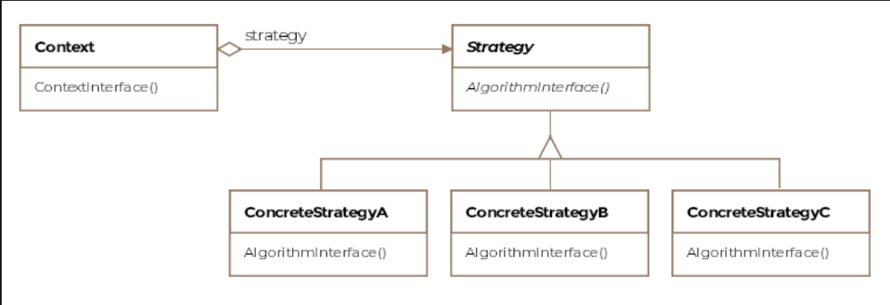

Strategy Pattern
This lesson discusses how a set of policies, algorithms or strategies can be made interchangeable without affecting the
clients using them.

We'll cover the following

What is it ?
Class Diagram
Examples
Other Examples
Caveats
What is it ?
The strategy pattern is one of the simpler patterns to comprehend. It allows grouping related algorithms under an
abstraction, which the client codes against. The abstraction allows switching out one algorithm or policy for another
without modifying the client.

The strategy pattern is formally defined as encapsulating algorithms belonging to the same family and making them
interchangeable. The consumers of the common interface that the algorithms implement allow switching out one algorithm
for another seamlessly.

Class Diagram
The class diagram consists of the following entities

Strategy
Concrete Strategy
Context

widget
Examples
Concrete algorithms implement the same interface. The context has the data the algorithm will act on. Together the
context and the strategy interact to implement the chosen algorithm. Usually, clients instantiate the context and pass
in the strategy object and then, only interact with the context object.

The most trivial example one can think of is the family of sorting algorithms. Say our application is only concerned
with sorting integer arrays. All the sorting algorithms can implement a common interface, that we call ISort

public interface ISort {

    void sort(int[] input);

}

The concrete implementations of the interface appear below:

public class BubbleSort implements ISort {

    @Override
    public void sort(int[] input) {
        // Do inefficient sorting in order n squared
    }

}

public class MergeSort implements ISort {

    @Override
    public void sort(int[] input) {
        // Do efficient sorting in nlogn
    }

}
The Context class holds a reference to the strategy object and when it receives requests from its clients, it forwards
them to the strategy object along with the required data.

public class Context {

    private ISort howDoISort;

    public Context(ISort howDoISort) {
        this.howDoISort = howDoISort;
    }

    // Context receives the data from its client
    // and passes it on to the strategy object.
    void sort(int[] numbers) {
        howDoISort.sort(numbers);
    }

    // We can change the sorting algorithm using this setter
    public void setHowDoISort(ISort howDoISort) {
        this.howDoISort = howDoISort;
    }

}

The client can use the context like so:

public class Client {

    private int[] numbers = new int[1000];

    void crunchingNumbers() {

        // Choose the sorting strategy
        BubbleSort bubbleSort = new BubbleSort();

        // Context receives the strategy object
        Context context = new Context(bubbleSort);

        // Sort the numbers
        context.sort(numbers);

        // Do remaining work
    }

}
Notice how the context keeps an interface reference and can be configured with any concrete sort implementation. The
implementation can also be changed at runtime through the setter. This decoupling of the client and the algorithms,
allows us to vary the algorithms independent of the client.

Other Examples
For our aircraft scenario, we can think about the different ways an F-16 can be equipped with weapons before each
mission. An F-16 can go for reconnaissance without carrying any weapons, it can be loaded with (God forbid) nuclear
weapons or it can carry Sidewinder missiles to intercept incoming enemy fighter jets. When modeling this scenario in our
code, we could create a ArmingStrategy interface which will have concrete implementations of NoWeapons, NuclearWeapons
and AirToAirWeapons as arming strategies for the plane. Before the F16 flies each mission we can set the armingStrategy
variable held in the F16 class with the desired arming strategy for the mission.

java.util.Comparator has the method compare which allows the user to define the algorithm or strategy to compare two
objects of the same type.

Think how a text editor such as Microsoft Word can make use of the strategy pattern when a client chooses the paragraph
alignment options. The strategies could be justify text, left-align, right-align or center-align.

Caveats
The context can either pass the required data or itself to the strategy object. In the latter case, the context would
expose methods on itself so that the strategy object can retrieve the required data.

Strategy objects are good candidates to be implemented as flyweight objects. This can reduce the memory requirements for
the application.

The context class can be simplified by providing a default strategy and only burdening the clients to provide a strategy
object, when the default doesn't meet their requirements.