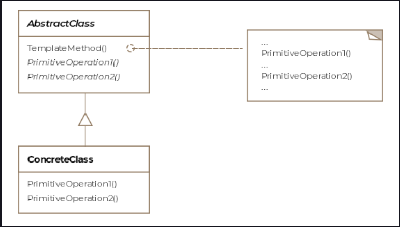

Template Method
This lesson discusses how algorithms with multiple steps can be made configurable by allowing subclasses to provide
behavior for some of the steps.

We'll cover the following

What is it ?
Class Diagram
Example
Other Examples
Caveats
What is it ?
A template can be thought of as a general or abstract structure that can be customized for specific situations. You may
have used a template for writing your resume. The template would define the overall structure of the document and leave
the details to be added in by the template user. The template method pattern is similar, it defines the skeleton or
steps of an algorithm but leaves opportunities for subclasses to override some of the steps with their own
implementations.

Formally, the pattern is defined as allowing subclasses to define parts of an algorithm without modifying the overall
structure of the algorithm.

The template method pattern factors out the common code among its subclasses and puts them into the abstract class. The
variable parts of the algorithm are left for the subclasses to override. These parts are template methods. A template
method defines an algorithm in terms of abstract operations that subclasses override to provide concrete behavior. The
ordering of the steps is fixed by the abstract class. Usually, the algorithm is represented as a series of methods which
are then invoked in the desired sequence in another method. Note that the classes may choose to ignore overriding
certain steps or choose to rely on the default implementation provided by the abstract class. The abstract class may
want to forbid the subclasses from overriding behavior for some steps, it can enforce this constraint by marking the
methods implementing those steps as final.

The opportunity afforded to subclasses for overriding some steps of the algorithm is through methods called hooks. A
hook denotes an optional step for the subclass to override whereas a method marked as abstract forces the subclasses to
provide an implementation for the step.

The template pattern method is very suitable for frameworks. A framework generally defines the application control flow
and gives developers the opportunity to override certain methods to customize the flow of their application needs. For
instance, the very popular message queuing framework Kafka allows developers to set the UncaughtExceptionHandler method
and give their application a chance to react to an uncaught exception. The developer can choose to ignore and not set
any handler. The template method pattern doesn't need to follow the textbook description of the pattern and can deviate
to fit in the given context but the underlying spirit should conform to the intent of the pattern description.

One of the benefits apart from code reuse of the template method pattern is that the higher level components don't
depend on lower level components and call the lower level components as and when required. When entities at various
levels depend horizontally and vertically on various other entities, it becomes what is called a Dependency Rot. The
pattern helps avoid the dependency rot by making the lower level components (subclasses) depend on the higher level
abstract class.

Class Diagram
The class diagram consists of the following entities

Abstract Class
Concrete Class
widget

Example
Let's take our aircraft example. Before each flight there's a list of tasks the pilots must go through that is called
the "pre-flight checklist". You can well imagine that for most of the aircrafts this list would have a lot of
commonalities. Therefore, it makes sense to model an abstract class that captures all the tasks in the preflight
checklist in the order they should be performed.

public abstract class AbstractPreFlightCheckList {

    // This method captures the template or the skeleton
    // of the algorithm for the pre-flight checklist.
    final public void runChecklist() {

        // Check fuel guage
        IsFuelEnough();

        // Check doors are locked
        doorsLocked();

        // Check air pressure
        checkAirPressure();
    }

    // Don't let subclasses override this method, this is a
    // mandatory check
    final protected void IsFuelEnough() {
        System.out.println("check fuel gauge");
    }

    // Some airplanes may or may not have doors so allow this
    // method to be overridden by subclasses
    protected boolean doorsLocked() {
        return true;
    }

    // Force subclasses to provide their own way of checking for
    // cabin or cockpit air pressure
    abstract void checkAirPressure();

}
The F-16 preflight checklist would then look like

public class F16PreFlightCheckList extends AbstractPreFlightCheckList {

    @Override
    void checkAirPressure() {
        // Implement the custom logic for checking cockpit
        // air pressure for F-16
    }

    @Override
    protected boolean doorsLocked() {
        // F-16 unlike a Boeing-747 has no doors
        // so always return true;
        return true;
    }

}
Since an F-16 doesn't have doors that need to be locked, it conveniently ignores providing an implementation for the
method doorsLocked and relies on the default implementation of the abstract class to take the right action.

Other Examples
Java's applets have gone down in popularity but the applet framework exposed a number of hooks for the developers. For
instance, the start method gave the application a chance to take action before the applet just got displayed in the
browser.
The java.io package has an abstract read() method in InputStream that subclasses must implement and is in turn invoked
by the method read(byte arg1[], int offet, int length).
The class javax.servlet.http.HttpServlet has a bunch of methods doGet, doPost and doPut etc, that can be overriden by
implementing classes.

Caveats
Don't confuse the template method pattern with the strategy pattern. Strategy pattern uses composition by accepting
objects that define the entire algorithm, whereas the template pattern method uses inheritance to vary parts of the
algorithm by subclasses but the outline and structure of the algorithm is still the realm of the abstract class.

Factory method pattern is a specialization of the template method pattern.

Ideally, the number of methods for which the subclasses need to provide implementation should be minimized when applying
the template method pattern.