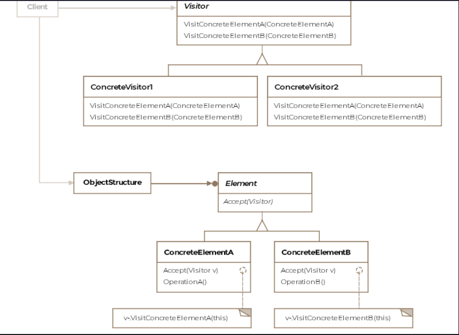

Visitor Pattern
This lesson discusses the visitor pattern which adds new behavior to composites without modifying the composite's or it'
s underlying elements' classes.

We'll cover the following

What is it ?
Class Diagram
Example
Double Dispatch
Other Examples
Caveats
What is it ?
The visitor pattern allows us to define an operation for a class or a class hierarchy without changing the classes of
the elements on which the operation is performed.

Recall the Airforce class example from the Composite Pattern lesson. The Airforce class is a composite consisting of
several different kinds of airplanes. It can be thought of as the object structure on whose elements we want to conduct
operations. The elements would be the individual planes that make up the airforce object structure.

Say if we are tasked with monitoring of various metrics for each aircraft such as remaining fuel, altitude and
temperature then one option would be to build this functionality inside the abstract class of all the airplanes. The
consequence would be that we'll need to implement the new methods in all the airplane subclasses. Now imagine, a few
days later we are tasked with calculating the total price tag for the Airforce. We will now add another method to the
abstract airplane class or interface that'll return the price for each individual plane and sum it across all the
airplanes.

There are several problems in our scenario, first the airplane class shouldn't be responsible for monitoring or pricing
data. It should just represent the aircraft. With each additional functionality, we'll end up bloating our aircraft
classes with new unrelated methods. The visitor patterns lets us out of this dilemma by suggesting to have a separate
class that defines the new functionality related to the aircraft. The methods in the AircraftVisitor class would take
the aircraft object as an argument and work on it. This saves us from changing our aircraft classes each time we need to
support a new functionality relating to the Airforce class.

Formally, the pattern is defined as defining operations to be performed on elements of an object structure without
changing the classes of the elements it works on.

The pattern is suitable in scenarios, where the object structure class or the classes that make up its elements don't
change often but new operations over the object structure are desired.

Class Diagram
The class diagram consists of the following entities

Visitor
Concrete Visitor
Element
Concrete Element
Object Structure
Class Diagram

Class Diagram

Example
Let's revisit our airforce example. The airforce class is the object structure on which we desire to introduce two new
operations, one for collecting metrics for all the planes and two the cost of each aircraft. Let's see the Airforce

public class Airforce {

    // Holds a collection of planes
    private Collection<IAircraft> planes = new ArrayList<>();

    // Returns an iterator to its collection of planes
    public Iterator<IAircraft> getIterator() {
        return planes.iterator();
    }

}
We'll consider two types of airplanes, the F16 and Boeing747. The interface defines an abstract accept(IAircraftVisitor
visitor) method that must be implemented by all derived classes. This method allows the visitor to access the concrete
class's interface, as you'll shortly see. The listing comes below:

public interface IAircraft {

    // Each concrete element class is expected to
    // define the accept method
    public void accept(IAircraftVisitor visitor);

}

public class F16 implements IAircraft {

    @Override
    public void accept(IAircraftVisitor visitor) {
        visitor.visitF16(this);
    }

}

public class Boeing747 implements IAircraft{

    @Override
    public void accept(IAircraftVisitor visitor) {
        visitor.visitBoeing747(this);
    }

}
Now we'll define the interface IVisitor and the two concrete visitors .

public interface IAircraftVisitor {

    void visitF16(F16 f16);

    void visitBoeing747(Boeing747 boeing747);

}
Notice how the visitor interface defines a visit method for each of the concrete types that make up the object
structure. Say if a new airplane C-130 was added to the object structure then the IAircraftVisitor would need to
introduce a new method visitC130. The visitor interface allows each aircraft to pass itself to the visitor by calling
the correponding visit method for its class on the visitor object. The visitor classes are given below:

public class MetricsVisitor implements IAircraftVisitor {

    public void visitF16(F16 f16){
        // Logic to get metrics for F16
    }

    public void visitBoeing747(Boeing747 boeing747){
        // Logic to get metrics for Boeing 747
    }

    public void printAccumulatedResults(){
        
    }

}

public class PriceVisitor implements IAircraftVisitor{

    @Override
    public void visitF16(F16 f16) {
        // Logic to get price for F16
    }

    @Override
    public void visitBoeing747(Boeing747 boeing747) {
        // Logic to get price for Boeing 747
    }

    public void printAccumulatedResults(){
        
    }

}
Note that each visitor can invoke methods specific to each concrete class. Even though the two airplane classes share
the same interface, the pattern allows us to work with classes that are unrelated or don't share a common interface.
Finally, the client code will look like below:

public class Client {

    public void main(Airforce airforce) {

        Iterator<IAircraft> planes = airforce.getIterator();
        MetricsVisitor aircraftVisitor = new MetricsVisitor();

        while (planes.hasNext()){
            planes.next().accept(aircraftVisitor);
        }
        
        aircraftVisitor.printAccumulatedResults();
    }

}
If we want to define a new operation on the object structure, then it is as easy as adding a new visitor class.

Each object structure will have an associated visitor class. This visitor interface will need to declare a
visitConcreteElement operation for each class of concreteElement defining the object structure. Each visit method on the
visitor interface will need to declare its argument to be a particular concreteElement, allowing the visitor to access
the interface of the concreteElement directly.

Double Dispatch
Take a look at the following code snippet and run it. Even though we save the reference for the BetterF16 object in a
variable of the super class F16, the outputs are printed for each of the object types correctly. This is an example of
dynamic dispatch where Java determines at runtime what class an instance belongs to and chooses the appropriate,
possibly overridden, method.

class Demonstration {
public static void main( String args[] ) {
F16 f16 = new F16();
f16.whoAmI();

        System.out.println();
      
        // Reference for the derived object 
        // is held in the superclass type
        F16 betterF16 = new BetterF16();
        betterF16.whoAmI();
    }
}

class F16 {

    public void whoAmI(){
        System.out.print("I am the mighty F-16.");
    }
}

class BetterF16 extends F16 {

    public void whoAmI(){
        System.out.print("I am the better than the mighty F-16.");
    }
}
Now consider the below code snippet. We add a method fire() which takes in an object of type Missile. We overload the
fire method with an object of a derived class BetterMissile.

class Demonstration {
public static void main( String args[] ) {
F16 f16 = new F16();
F16 betterF16 = new BetterF16();
Missile missile = new Missile();
Missile betterMissile = new BetterMissile();

        System.out.println("Expected output");
        f16.fireMissile(missile);
        betterF16.fireMissile(missile);
        System.out.println();

        System.out.println("Failed double dispatch attempt");      
        f16.fireMissile(betterMissile);
        betterF16.fireMissile(betterMissile);
        System.out.println();      

        System.out.println("Expected output");      
        BetterMissile reallyBetterMissile = new BetterMissile();
        f16.fireMissile(reallyBetterMissile);
        betterF16.fireMissile(reallyBetterMissile);
        System.out.println();      
    }
}

class BetterMissile extends Missile {

    @Override
    public String explode() {
        return " very very big baaam";
    }
}

class Missile {

    public String explode() {
        return " baaaam";
    }
}

class BetterF16 extends F16 {

    public String whoAmI() {
        return "Better F16";
    }
}

class F16 {

    public String whoAmI() {
        return "F16";
    }

    public void fireMissile(Missile missile) {
        System.out.println(whoAmI() + " fired ordinary missile: " + missile.explode());
    }

    public void fireMissile(BetterMissile missile) {
        System.out.println(whoAmI() + " fired better missile: " + missile.explode());
    }
}
If you run the above code the lines 14-15 call the fire with a reference of type Missile pointing to an object of type
BetterMissile. The JVM doesn't check the type of the object at runtime and invokes fire(Missile) instead of fire(
BetterMissile). Languages which support double dispatch or multiple dispatch, would have invoked the right intended
method fire(BetterMissile).

In the visitor pattern the accept() method simulates the double dispatch effect.

    public void accept(IAircraftVisitor visitor) {
        visitor.visitF16(this);
    }

The first dispatch is when an airplane object calls the accept method. If the airplane object is of type F16 or
Boeing747, the corresponding accept method on those classes is called. The second dispatch happens when the visitor
interface reference passed into the accept method correctly calls the corresponding visit method on the concrete visitor
object the reference points to.

Other Examples
java.nio.file.FileVisitor interface has an implementation class of SimpleFileVisitor which is an example of a visitor.
The interface is defined as a visitor of files. An implementation of this interface is provided to the
Files.walkFileTree methods to visit each file in a file tree.

javax.lang.model.element.Element interface represents a program element such as a package, class, or method. To
implement operations based on the class of an Element object not known at compile an implementation of the
javax.lang.model.element.ElementVisitor interface is required.

Caveats
The visitor pattern cautions that if one expects the object structure classes to change often then it might be a good
idea to just keep the new functionality within the visited classes instead of using the visitor pattern. The key
consideration in applying the Visitor pattern is if the algorithm applied over an object structure is more likely to
change or the classes of objects that make up the structure. The visitor class hierarchy can be difficult to maintain
when new concrete element classes are added frequently. In such cases, it's probably easier just to define operations on
the classes that make up the structure. If the Element class hierarchy is stable, but you are continually adding
operations or changing algorithms, then the visitor pattern will help you manage the changes.

Adding new concrete classes will require modifying all the visitor classes, which makes it hard to add new types to the
object structure.

Iteration over the object structure can happen via an iterator, inside the object structure or by the visitor.

Note that an iterator requires that a composite be made up of elements that all conform to the same base class or
interface, whereas a visitor can visit all the elements of a composite even if they are unrelated.

Languages that support double or multiple dispatch lessen the need for the visitor pattern.