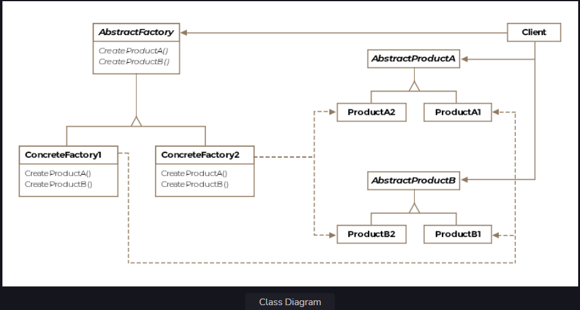

# Padrão abstrato de fábrica
Esta lição detalha o funcionamento de mais um padrão de design de padrões. Criativo, que nos permite criar uma família de
produtos de maneira flexível e extensível.

Abordaremos o seguinte

O que é ?
Diagrama de classes
Exemplo
Codifique para uma interface, não para uma implementação
Criando uma fábrica
Fábrica de Fábricas
Implementação
Outros exemplos
Ressalvas

# O que é?
Na lição anterior, aprendemos o padrão do método de fábrica. Vimos como conseguimos modelar as variantes do F-16
usando o método de fábrica. Mas existem vários aviões além do F-16 que precisaremos representar. Diga o cliente
compra um Boeing-747 para o CEO viajar e agora quer que seu software dê suporte a esse novo tipo de aeronave.

O padrão abstrato de fábrica resolve o problema de criação de famílias de produtos relacionados. Por exemplo, o F-16 precisa de um
motor, cabine e asas. O Boeing-747 exigiria o mesmo conjunto de peças, mas seriam específicas da Boeing.
Qualquer avião exigiria essas três peças relacionadas, mas as peças serão específicas do avião e do fornecedor. Você pode ver um
padrão surge aqui? Precisamos de uma estrutura para criar as peças relacionadas para cada avião, uma família de peças para o
F-16, uma família de peças para o Boeing-747 e assim por diante.

Formalmente, o padrão abstrato de fábrica é definido como a definição de uma interface para criar famílias de componentes relacionados ou dependentes.
objetos sem especificar suas classes concretas.

# Diagrama de Classes
O diagrama de classes consiste nas seguintes entidades

Fábrica Abstrata
Fábrica de concreto
Produto abstrato
Produto Concreto
Cliente
Diagrama de classes
Diagrama de classes

# Exemplo
Uma fábrica abstrata pode ser considerada um superfator ou uma fábrica de fábricas. O padrão alcança a criação de
uma família de produtos sem revelar classes concretas ao cliente. Vamos considerar um exemplo. Diga, você está criando
um software de simulação para a indústria da aviação e precisa representar diferentes aeronaves como objetos. Mas antes de você
representar uma aeronave, você também precisa representar as diferentes peças de uma aeronave como objetos. Por enquanto vamos escolher
três: a cabine, as asas e o motor. Agora digamos que a primeira aeronave que você deseja representar seja o poderoso F-16.
Você provavelmente escreverá três classes, uma para cada peça específica do F-16. No seu código você provavelmente consumirá apenas
criou três classes da seguinte forma:

    public void principal() {
        F16Cockpit f16Cockpit = novo F16Cockpit();
        F16Motor f16Motor = novo F16Motor();
        F16Wings f16Wings = new F16Wings();
    
        List<F16Engine> motores = new ArrayList<>();
        motores.add(f16Motor);
        para (F16Motor motor: motores) {
            ligar o motor();
        }
    }

Este trecho de aparência inócua pode causar fortes dores de cabeça no futuro se o seu software de simulação decolar e você
necessidade de expandi-lo para outras aeronaves. Abaixo está uma lista do que há de errado com o trecho acima:

As classes concretas das três partes foram expostas diretamente ao consumidor.

O F-16 tem diversas variantes com motores diferentes e diga no futuro se você deseja retornar o objeto do motor correspondente ao
variante, você precisará criar uma subclasse da classe F16Engine e isso também exigiria uma alteração no snippet do consumidor.

A Lista no trecho de código é parametrizada com uma classe concreta, no futuro, se você adicionar outro objeto de motor de aeronave
então o novo motor não pode ser adicionado à lista, mesmo que os motores de todas as aeronaves sejam um tanto semelhantes.

Corrigiremos esses problemas um por um e veremos como o padrão abstrato de fábrica surgiria.

# Código para uma interface e não para uma implementação
Um dos princípios fundamentais de um bom design orientado a objetos é ocultar as classes concretas e expor as interfaces.
aos clientes. Um objeto responde a um conjunto de solicitações, essas solicitações podem ser capturadas por uma interface que o objeto
implementos de classe. O cliente deve saber a quais solicitações um objeto responde, e não a implementação.

Em nosso exemplo, podemos criar uma interface IEngine, que expõe o método start(). A classe F16Engine seria então
mude assim:

interface pública IEngine {

    void início();

}

classe pública F16Engine implementa IEngine {

    @Sobrepor
    public void início() {
        System.out.println("Motor F16 ligado");
    }

}
Com a alteração acima veja como muda o código do consumidor correspondente

    public void principal() {
        IEngine f16Engine = new F16Engine();
        List<IEngine> motores = new ArrayList<>();
        motores.add(f16Motor);
        for (motor IEngine: motores) {
            ligar o motor();
        }
    }

De repente, o código do consumidor fica livre dos detalhes de implementação de qual classe implementa o motor F-16 e com a qual trabalha.
uma interface. No entanto, ainda gostaríamos de ocultar a nova parte F16Engine() do código. Não queremos que o consumidor
saber qual classe estamos instanciando. Isso é discutido a seguir.

#Criando uma fábrica
Em vez de criar objetos novos no código do cliente, teremos uma classe responsável por fabricar os objetos solicitados e
devolvendo-os ao cliente. Chamaremos essa classe de F16Factory, pois ela pode criar as diversas partes da aeronave F16.
e entregá-los ao cliente solicitante. A classe tomaria a seguinte forma.

classe pública F16Factory {

    public IEngine createEngine() {
        retornar novo F16Engine();
    }

    public IWings createWings() {
        retornar novo F16Wings();
    }

    public ICockpit createCockpit() {
        retornar novo F16Cockpit();
    }

}
Suponha que passamos o objeto F16Factory no construtor para o código do cliente e ele agora criaria objetos como este:

    public void principal(F16Factory f16Factory) {
        IEngine f16Engine = f16Factory.createEngine();
        List<IEngine> motores = new ArrayList<>();
        motores.add(f16Motor);
        for (motor IEngine: motores) {
            ligar o motor();
        }
    }

Observe como esta configuração nos permite a liberdade de alterar a classe concreta que representa o F16Engine, desde que ele seja confirmado
para a interface do IEngine. Podemos renomear, aprimorar ou modificar nossa classe sem causar uma alteração significativa no cliente.
Observe também que apenas diferindo a classe de fábrica passada para o construtor do cliente, podemos fornecer ao cliente
com as mesmas peças para uma aeronave completamente nova. Isso é discutido a seguir.

# Fábrica de Fábricas
Não seria ótimo se pudéssemos usar o mesmo snippet de cliente para outras aeronaves, como o Boeing747 ou um MiG-29 russo?
Se pudéssemos fazer com que todas as fábricas passadas para o cliente concordassem em implementar o método createEngine(), então o
o código do cliente continuará funcionando para todos os tipos de fábricas de aeronaves. Mas todas as fábricas devem comprometer-se com um objectivo comum
interface cujos métodos eles implementarão e esta interface comum será a fábrica abstrata.

# Implementação
Vamos começar com uma interface que definiria os métodos que as fábricas de diferentes aeronaves precisariam para
implemento. O código do cliente é escrito na fábrica abstrata, mas composto em tempo de execução com uma fábrica concreta.

interface pública IAircraftFactory {

    IEngine createEngine();

    IWings createWings();

    ICockpit createCockpit();

}
Observe que nos referimos a uma classe abstrata Java ou uma interface Java quando nos referimos a "interface". Neste caso, poderíamos
usei uma classe abstrata se houvesse uma implementação padrão para qualquer um dos produtos. Os métodos de criação não
devolver produtos concretos em vez de interfaces para dissociar os consumidores da fábrica da implementação concreta das peças.

A definição formal do padrão abstrato de fábrica diz que o padrão abstrato de fábrica define uma interface para criar
famílias de produtos relacionados sem especificar as classes concretas. Aqui o IAircraftFactory é aquela interface no
definição formal e observe como seus métodos de criação não estão retornando partes concretas, mas sim interfaces que serão
implementado pelas classes das partes concretas.

A seguir vamos definir nossas fábricas para as duas aeronaves.

A classe pública F16Factory implementa IAircraftFactory {

    @Sobrepor
    public IEngine createEngine() {
        retornar novo F16Engine();
    }

    @Sobrepor
    public IWings createWings() {
        retornar novo F16Wings();
    }

    @Sobrepor
    public ICockpit createCockpit() {
        retornar novo F16Cockpit();
    }

}

classe pública Boeing747Factory implementa IAircraftFactory {

    @Sobrepor
    public IEngine createEngine() {
        retornar novo Boeing747Engine();
    }

    @Sobrepor
    public IWings createWings() {
        retornar novo Boeing747Wings();
    }

    @Sobrepor
    public ICockpit createCockpit() {
        retornar novo Boeing747Cockpit();
    }

}
As fábricas de concreto serão responsáveis pela criação de motores, cabine e asas específicas para F-16 ou Boeing. Cada parte tem
uma interface de produto correspondente que não listamos por questões de brevidade. As interfaces que representam as partes seriam:

Motor

Cockpit

IWings

Todos os métodos de criação são, na verdade, métodos de fábrica que foram substituídos. Na verdade, o padrão do método de fábrica é
utilizado ao implementar o padrão abstrato de fábrica. Por uma questão de brevidade, deixamos de listar os aspectos concretos
aulas de motor, asas e cabine.

Na lição anterior, criamos uma classe para F-16 que incluía um método público fly(). Este método invocado internamente
o método makeF16() e depois que a aeronave foi fabricada, invocou o método taxi() antes de imprimir uma mosca
declaração. No nosso cenário, espera-se que todas as aeronaves sigam o mesmo padrão. Eles primeiro são fabricados, depois
taxiar na pista e depois voar para longe. Podemos assim criar uma classe para uma aeronave que execute essas três tarefas. Observe, como
não estamos criando classes separadas para representar as duas aeronaves, ou seja, o F-16 e o Boeing-747, e sim uma única aeronave
classe que pode representar ambos.

// Esqueleto incompleto da classe.
classe pública Aeronave {

    Motor IEngine;
    Cockpit do ICockpit;
    Asas IWings;

    Aeronave protegida makeAircraft() {
        //TODO: fornecer implementação
    }

    táxi vazio privado() {
        System.out.println("Tributação na pista");
    }

    public void fly() {
        Aeronave = makeAircraft();
        aeronave.táxi();
        System.out.println("Voando");
    }

}
Por enquanto manteremos o método makeAircraft vazio. Vamos primeiro ver como um cliente solicitará objetos F-16 e Boeing-747.

classe pública Cliente {

    public void principal() {

        // Instancia uma fábrica concreta para o F-16
        F16Factory f16Factory = new F16Factory();
        
        // Instancia uma fábrica concreta para Boeing-747
        Boeing747Factory boeing747Factory = nova Boeing747Factory();
        
        // Vamos criar uma lista de todos os nossos aviões
        Collection<Aeronave> meusPlanes = new ArrayList<>();
        
        // Cria um novo F-16 passando na fábrica f16
        myPlanes.add(nova aeronave(f16Factory));

        // Crie um novo Boeing-747 passando pela fábrica da Boeing
        myPlanes.add(nova aeronave(boeing747Factory));

        // Voe todos os seus aviões
        para (Aeronaves: myPlanes) {
            aeronave.fly();
        }

    }

}
Precisaremos adicionar um construtor à nossa classe Aircraft, que armazenará o objeto fábrica passado e criará o
peças de aeronaves usando a fábrica. Apenas compondo o objeto da aeronave com uma fábrica diferente conseguimos obter uma
aeronaves diferentes. A versão completa da classe da aeronave ficaria assim:

classe pública Aeronave {

    Motor IEngine;
    Cockpit do ICockpit;
    Asas IWings;
    Fábrica de aeronaves;

    aeronave pública(fábrica IAircraftFactory) {
        this.factory = fábrica;
    }

    Aeronave protegida makeAircraft() {
        motor = fábrica.createEngine();
        cockpit = fábrica.createCockpit();
        asas = fábrica.createWings();
        devolva isso;
    }

    táxi vazio privado() {
        System.out.println("Tributação na pista");
    }

    public void fly() {
        Aeronave = makeAircraft();
        aeronave.táxi();
        System.out.println("Voando");
    }

}
O cliente só precisa instanciar a fábrica certa e passá-la. O consumidor ou cliente da fábrica é o
Classe de aeronaves. Poderíamos ter criado uma interface IAircraft para representar todas as aeronaves que a classe Aircraft pertence.
turn implementaria, mas para nosso exemplo limitado não é necessário.

O código resultante é facilmente extensível e flexível.
Para vincular nosso exemplo atual ao exemplo discutido na lição de padrão de método de fábrica, temos a opção de
subclassificar ainda mais o F16Factory para criar fábricas para as variantes A e B do F-16. Poderíamos também parametrizar o
fábrica F16Factory existente para receber uma enumeração especificando o modelo da variante e, consequentemente, retornar a parte correta em um
instrução switch.

# Outros exemplos
A fábrica abstrata é particularmente útil para frameworks e kits de ferramentas que funcionam em diferentes sistemas operacionais. Para
Por exemplo, se sua biblioteca fornece widgets sofisticados para a interface do usuário, você pode precisar de uma família de produtos que funcionem no MacOS
e uma família semelhante de produtos que funcionam no Windows. Da mesma forma, os temas usados no IDE podem ser outro exemplo. Se o seu IDE
suporta temas claros e escuros, então ele pode usar o padrão abstrato de fábrica para criar widgets que pertencem à luz
ou tema escuro apenas variando a fábrica concreta que cria os widgets.

javax.xml.parsers.DocumentBuilderFactory.newInstance() retornará uma fábrica.

javax.xml.transform.TransformerFactory.newInstance() retornará uma fábrica.

# Ressalvas
Pode parecer ao leitor ingênuo que o padrão do método de fábrica e o padrão de fábrica abstrato são semelhantes. O
A diferença entre os dois está em suas motivações. O padrão de método de fábrica geralmente é responsável por criar um
único produto, enquanto um padrão abstrato de fábrica cria famílias inteiras de produtos relacionados. Além disso, no
padrão de método de fábrica, usamos herança para criar produtos mais especializados, enquanto, em um padrão de fábrica abstrato,
praticamos a composição de objetos passando pelas fábricas que são consumidas para criar os produtos desejados.

Em nosso exemplo de aeronave, podemos adicionar uma nova aeronave simplesmente criando uma fábrica concreta para ela. Contudo, note que se um
helicóptero for adicionado à frota e exigir uma peça que uma aeronave não possui, então precisaremos estender o
Interface IAircraftFactory com outro método de criação para a peça exigida apenas pelo helicóptero. Isso irá cascata
a mudança nas fábricas existentes que precisarão retornar nulo, pois o novo componente não faz parte dos jatos.

As fábricas de concreto podem ser melhor representadas como um objeto singleton