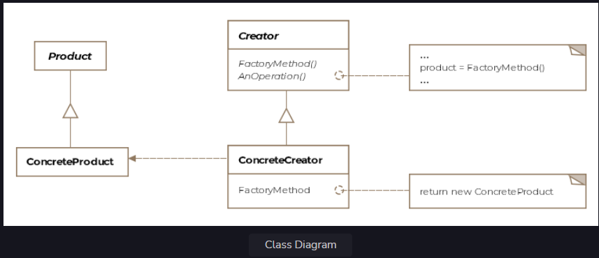

Factory Method Pattern
This lesson discusses how derived classes can be given the responsibility of creating appropriate objects.

We'll cover the following

What is it ?
Class Diagram
Example
Differences with Simple/Static Factory
Other Examples
Caveats
What is it ?
A factory produces goods, and a software factory produces objects. Usually, object creation in Java takes place like so:

SomeClass someClassObject = new SomeClass();
The problem with the above approach is that the code using the SomeClass's object, suddenly now becomes dependent on the concrete implementation of SomeClass. There's nothing wrong with using new to create objects but it comes with the baggage of tightly coupling our code to the concrete implementation class, which is a violation of code to an interface and not to an implementation.

Formally, the factory method is defined as providing an interface for object creation but delegating the actual instantiation of objects to subclasses.

Class Diagram
The class diagram consists of the following entities

Product
Concrete Product
Creator
Concrete Creator
Class Diagram
Class Diagram

Example
Continuing with our aircraft example scenario, let's assume we are trying to model the F-16 fighter jet. The client code needs to construct the engine object for the fighter jet and fly it. The naive implementation for the class would be something like below:

public class F16 {

    F16Engine engine;
    F16Cockpit cockpit;

    protected void makeF16() {
        engine = new F16Engine();
        cockpit = new F16Cockpit();
    }

    public void fly() {
        makeF16();
        System.out.println("F16 with bad design flying");
    }
}

public class Client {

    public void main() {

        // We instantiate from a concrete class, thus tying
        // ourselves to it
        F16 f16 = new F16();
        f16.fly();
    }
}
In the above code, we have committed ourselves to using a concrete implementation of the F16 class. What if the company comes up with newer versions of the aircraft and we are required to represent them in the program? That would make us change the client code where we new-up the F16 instance. One way out, is to encapsulate the object creation in another object that is solely responsible for new-ing up the requested variants of the F-16. For starters, let's say we want to represent the A and B variants of F16, then the code would look like:

public class F16SimpleFactory {

    public F16 makeF16(String variant) {

        switch (variant) {
        case "A":
            return new F16A();
        case "B":
            return new F16B();
        default:
            return new F16();
        }
    }
}
The above is an example of a Simple Factory and isn't really a pattern but a common programming idiom. You could also mark the make method static to skip the factory object creation step. However, since static methods can't be overridden in subclasses because they are unique to a class, we won't be able to subclass the Static Factory. Remember simple and static factories aren't the same as the factory method pattern.

However, if we want to keep the creation of the F16 object parts within the same class and still be able to introduce new F16 variants as they come along, we could subclass F16 and delegate the creation of the right F16 variant object to the subclass handling that variant. This is exactly the factory method pattern! The method here is the makeF16() which we'll make behave like a factory that produces the appropriate F16 variants. Proceeding forward we introduce two subclasses like so

public class F16 {

    IEngine engine;
    ICockpit cockpit;

    protected F16 makeF16() {
        engine = new F16Engine();
        cockpit = new F16Cockpit();
        return this;
    }

    public void taxi() {
        System.out.println("F16 is taxing on the runway !");
    }

    public void fly() {
        // Note here carefully, the superclass F16 doesn't know
        // what type of F-16 variant it was returned.
        F16 f16 = makeF16();
        f16.taxi();
        System.out.println("F16 is in the air !");
    }
}

public class F16A extends F16 {

    @Override
    public F16 makeF16() {
        super.makeF16();
        engine = new F16AEngine();
        return this;
    }
}

public class F16B extends F16 {

    @Override
    public F16 makeF16() {
        super.makeF16();
        engine = new F16BEngine();
        return this;
    }
}
We used inheritance to subclass and specialize the engine object. A factory method may or may not provide a default or generic implementation but lets subclasses specialize or modify the product by overriding the create/make methods. In our example the variant models only have a different engine but the same cockpit. The client code can now use the newer models like so:

public class Client {
public void main() {
Collection<F16> myAirForce = new ArrayList<F16>();
F16 f16A = new F16A();
F16 f16B = new F16B();
myAirForce.add(f16A);
myAirForce.add(f16B);

        for (F16 f16 : myAirForce) {
            f16.fly();
        }
    }
}
Note that the factory method pattern, returns an abstract type, be it a Java interface or a Java abstract class. The superclass, in our case F16 doesn't know what variant of the F16 it was returned from the makeF16() method. The general setup is that the superclass has the implementation for all the methods other than the creation methods. A create method is either abstract or comes with a default implementation and in turn is invoked by the other methods of the superclass. The creation of the right objects is the responsibility of the subclasses.

Differences with Simple/Static Factory
The factory method pattern might seem very similar to the simple or static factory, however, the primary difference is that simple factories can't produce varying products through inheritance as a factory method pattern can.

Other Examples
The factory method pattern pervades toolkits and frameworks. The pattern can be used whenever a class doesn't know ahead of time what subclass objects it would need to instantiate. This is common problem in designing frameworks, where the consumers of the framework are expected to extend framework provided abstract classes and hook-in functionality or object creations.

The Java API exposes several factory methods:

java.util.Calendar.getInstance()
java.util.ResourceBundle.getBundle()
java.text.NumberFormat.getInstance()
Caveats
The pattern can result in too many subclasse with very minor differences.
If the subclass extends the functionality, then the superclass can't use it unless it downcasts it to the concrete type. The downcast may fail at runtime.