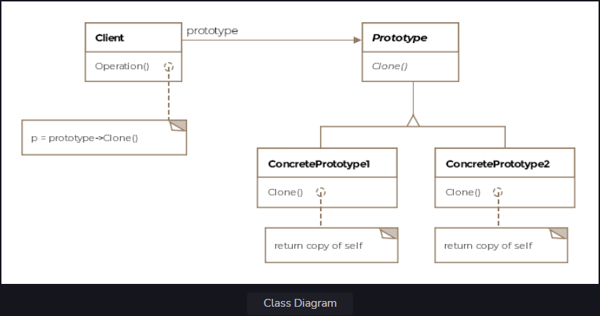

Prototype Pattern
This lesson discusses how new objects can be created from existing objects using the prototype pattern.

We'll cover the following

What is it ?
Class Diagram
Example
Shallow vs Deep Copy
Dynamic Loading
Other examples
Caveats
What is it ?
Prototype pattern involves creating new objects by copying existing objects. The object whose copies are made is called the prototype. You can think of the prototype object as the seed object from which other objects get created but you might ask why would we want to create copies of objects, why not just create them anew? The motivations for prototype objects are as follows:

Sometimes creating new objects is more expensive than copying existing objects.

Imagine a class will only be loaded at runtime and you can't access its constructor statically. The run-time environment creates an instance of each dynamically loaded class automatically and registers it with a prototype manager. The application can request objects from the prototype manager which in turn can return clones of the prototype.

The number of classes in a system can be greatly reduced by varying the values of a cloned object from a prototypical instance.

Formally, the pattern is defined as specify the kind of objects to create using a prototypical instance as a model and making copies of the prototype to create new objects.

Class Diagram
The class diagram consists of the following entities

Prototype
Concrete Prototype
Client
Class Diagram
Class Diagram

Example
Let's take an example to better understand the prototype pattern. We'll take up our aircraft example. We created a class to represent the F-16. However, we also know that F-16 has a handful of variants. We can subclass the F16 class to represent each one of the variants but then we'll end up with several subclasses in our system. Furthermore, let's assume that the F16 variants only differ by their engine types. Then one possibility could be, we retain only a single F16 class to represent all the versions of the aircraft but we add a setter for the engine. That way, we can create a single F16 object as a prototype, clone it for the various versions and compose the cloned jet objects with the right engine type to represent the corresponding variant of the aircraft.

First we create an interface

public interface IAircraftPrototype {

    void fly();

    IAircraftPrototype clone();

    void setEngine(F16Engine f16Engine);
}
The F-16 class would implement the interface like so:

public class F16 implements IAircraftPrototype {

    // default engine
    F16Engine f16Engine = new F16Engine();

    @Override
    public void fly() {
        System.out.println("F-16 flying...");
    }

    @Override
    public IAircraftPrototype clone() {
        // Deep clone self and return the product
        return new F16();
    }

    public void setEngine(F16Engine f16Engine) {
        this.f16Engine = f16Engine;
    }
}
And the client can exercise the pattern like so:

public class Client {

    public void main() {

        IAircraftPrototype prototype = new F16();

        // Create F16-A
        IAircraftPrototype f16A = prototype.clone();
        f16A.setEngine(new F16AEngine());

        // Create F16-B
        IAircraftPrototype f16B = prototype.clone();
        f16B.setEngine(new F16BEngine());
    }
}
Note that the interface IAircraftPrototype clone method returns an abstract type. The client doesn't know the concrete subclasses. The Boeing747 class can just as well implement the same interface and be on its way to produce copies of prototypes. The client if passed in the prototype as IAircraftPrototype wouldn't know whether the clone's concrete subclass is an F16 or a Boeing747.

The prototype pattern helps eliminate subclassing as the behavior of prototype objects can be varied by composing them with subparts.

Shallow vs Deep Copy
The prototype pattern requires that the prototype class or interface implements the clone() method. Cloning can be either shallow or deep. Say our F-16 class has a member object of type F16Engine. In a shallow copy, the cloned object would point to the same F16Engine object as the prototype. The engine object would end up getting shared between the two. However, in a deep copy, the cloned object would get a copy of its own engine object as well as any of the nested objects within it. There will be no sharing of any fields, nested or otherwise between the prototype and the clone.

Dynamic Loading
The prototype pattern also helps with dynamic loading of classes. Language frameworks which allow dynamic loading will create an instance of the loaded class and register it in a managing entity. The application can at runtime request the object of the loaded class from the manager. Note, the application can't access the class's constructor statically.

Other examples
In Java the root Object class exposes a clone method. The class implements the interface java.lang.Cloneable.
Caveats
Implementing the clone method can be challenging because of circular references.